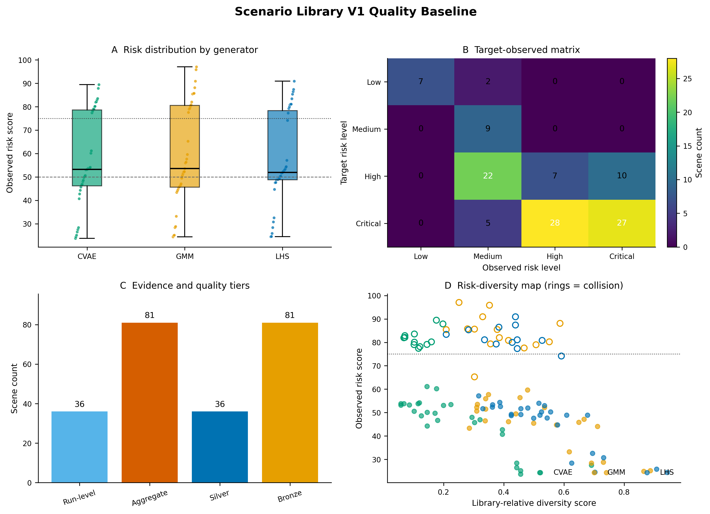

# 场景库 V1 质量分析基线

- 分析日期：`2026-08-18`。
- 输入：`D:\Xx\竞赛\大创实施ing\data\scenarios\scenario_library_v1\entries.jsonl`。
- 输入 SHA-256：`6038a288a77b37ab89210b2ee201849e531663c54f5b0203e4df865f9a5bd23a`。
- 本报告仅离线分析已归档场景条目，没有重新运行 CARLA。

## 总体结论

- 当前库包含 `117` 个独立场景和 `351` 次来源批次严格验收运行。
- 实测 high/critical 场景 `72` 个，占 `61.5%`；碰撞场景 `39` 个，占 `33.3%`。
- 目标风险与实测主档完全一致的场景 `50` 个，命中率 `42.7%`；目标档序号与实测分数的 Spearman 为 `0.708`。
- 场景库内相对多样性均值为 `0.393`，其中 `30` 个场景被标记为低相对多样性。
- 逐次证据 `36` 个、聚合证据 `81` 个；质量等级为 silver `36` 个、bronze `81` 个。
- 直接逐次验收依据 `36` 个；继承来源批次验收依据 `81` 个。
- `117` 个条目未记录场景级 CARLA 版本，`117` 个条目的真实性尚未评估。

## 生成器分布

| 生成器 | 场景数 | 平均风险 | 高/临界 | 碰撞 | 目标命中 | 平均多样性 |
|---|---:|---:|---:|---:|---:|---:|
| CVAE | 39 | 56.461 | 61.5% | 30.8% | 41.0% | 0.212 |
| GMM | 39 | 59.647 | 61.5% | 38.5% | 43.6% | 0.467 |
| LHS | 39 | 56.947 | 61.5% | 30.8% | 43.6% | 0.499 |

这些指标描述当前风险反馈驱动样本库，不代表各生成器在自然交通分布中的总体表现。

## 目标与实测风险

| 目标\实测 | low | medium | high | critical | 合计 |
|---|---:|---:|---:|---:|---:|
| low | 7 | 2 | 0 | 0 | 9 |
| medium | 0 | 9 | 0 | 0 | 9 |
| high | 0 | 22 | 7 | 10 | 39 |
| critical | 0 | 5 | 28 | 27 | 60 |

目标档序号与实测风险档序号的 Spearman 为 `0.630`。当前库以 high/critical 目标为主，适合作为压力测试库，但不适合直接估计真实道路风险发生率。

## 证据与质量边界

- `run_level/silver` 条目保留逐次运行证据；`aggregate/bronze` 条目只保留场景级聚合血缘。
- 聚合条目继承来源批次的严格验收结论，但不能据此补造逐次 `run_id`、配置路径或元数据路径。
- 当前所有条目均缺少可直接查询的场景级 CARLA 版本字段，因此不能评为 gold。
- 真实性保持 `not_assessed`；获得同口径真实世界参数分布前，不计算真实性分数。
- 多样性是当前 117 条记录内部的 15 维归一化最近邻指标，扩库后必须重新计算。

## 高风险优先审查场景

| 场景 | 生成器 | 目标 | 实测 | 分数 | 碰撞 | 证据 | 质量 | 多样性 |
|---|---|---|---|---:|---:|---|---|---:|
| gmm_critical_20260816_0165 | gmm | critical | critical | 97.040 | 是 | aggregate | bronze | 0.251 |
| gmm_critical_20260816_0070 | gmm | critical | critical | 95.849 | 是 | aggregate | bronze | 0.353 |
| gmm_critical_20260816_0243 | gmm | critical | critical | 90.933 | 是 | aggregate | bronze | 0.330 |
| lhs_critical_20260818_0046 | lhs | critical | critical | 90.919 | 是 | aggregate | bronze | 0.439 |
| cvae_critical_20260818_0165 | cvae | critical | critical | 89.460 | 是 | aggregate | bronze | 0.176 |
| gmm_critical_20260818_0250 | gmm | critical | critical | 88.110 | 是 | aggregate | bronze | 0.587 |
| cvae_high_20260815_0159 | cvae | high | critical | 87.867 | 是 | aggregate | bronze | 0.198 |
| lhs_critical_20260816_0065 | lhs | critical | critical | 87.396 | 是 | aggregate | bronze | 0.439 |
| lhs_critical_20260816_0224 | lhs | critical | critical | 86.473 | 是 | aggregate | bronze | 0.384 |
| gmm_critical_20260816_0112 | gmm | critical | critical | 85.765 | 是 | aggregate | bronze | 0.280 |

## 低多样性优先审查场景

| 场景 | 生成器 | 目标 | 实测 | 分数 | 碰撞 | 证据 | 质量 | 多样性 |
|---|---|---|---|---:|---:|---|---|---:|
| cvae_critical_20260816_0052 | cvae | critical | high | 53.147 | 否 | aggregate | bronze | 0.057 |
| cvae_critical_20260816_0062 | cvae | critical | high | 53.853 | 否 | aggregate | bronze | 0.057 |
| cvae_critical_20260816_0044 | cvae | critical | critical | 81.954 | 是 | aggregate | bronze | 0.068 |
| cvae_critical_20260817_0185 | cvae | critical | high | 53.804 | 否 | aggregate | bronze | 0.068 |
| cvae_critical_20260817_0225 | cvae | critical | critical | 82.113 | 是 | aggregate | bronze | 0.071 |
| cvae_critical_20260818_0125 | cvae | critical | critical | 82.868 | 是 | aggregate | bronze | 0.071 |
| cvae_critical_20260816_0182 | cvae | critical | high | 53.266 | 否 | aggregate | bronze | 0.086 |
| cvae_high_20260815_0253 | cvae | high | critical | 79.038 | 是 | aggregate | bronze | 0.102 |
| cvae_high_20260817_0158 | cvae | high | high | 50.605 | 否 | aggregate | bronze | 0.102 |
| cvae_critical_20260816_0163 | cvae | critical | critical | 83.566 | 是 | aggregate | bronze | 0.103 |

## 后续动作

1. 使用本基线为构建器和查询 CLI 增加固定样本回归测试，冻结 Schema、哈希和检索字段。
2. 新增运行必须记录 CARLA 客户端/服务端版本、配置哈希和逐次元数据路径，逐步提升 gold 条目比例。
3. 后续扩库继续保留生成器、目标风险、碰撞和多样性配额，避免只堆积高分近重复样本。
4. 真实性评估单独等待可映射到 15 维参数的公开或真实世界参考数据，不与当前危险性评分混合。
