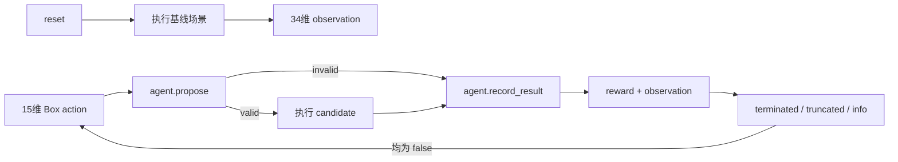

# 对抗性测试代理 Gymnasium 接口评估 V1

_评估日期：2026年8月20日；范围：阶段四场景间对抗性测试代理，不启动 RL 训练_

---

## 📋 评估结论

当前代理契约**适合封装为 Gymnasium 环境**，但暂不把 `gymnasium` 或 Stable-Baselines3 加入当前 CARLA 运行环境，也不启动训练。现有核心逻辑已经具备动作校验、34 维观测、奖励分解、失败终止和重复/步数截断；缺少的是标准环境外壳、初始场景采样策略和依赖隔离。

Gymnasium 的当前接口要求 `reset()` 返回 `(observation, info)`，`step()` 返回 `(observation, reward, terminated, truncated, info)`；episode 在任一结束标志为真后必须重新 `reset()`。[^1] 这与当前 `AgentTransition` 的两个独立状态字段可以直接对应。

## 🔄 接口映射

| Gymnasium 项 | 当前项目映射 | 评估结果 |
|---|---|---|
| `action_space` | `Box(low=-1, high=1, shape=(15,), dtype=float32)` | 可直接映射；动作语义已归一化 |
| `observation_space` | `Box(low=0, high=1, shape=(34,), dtype=float32)` | 可直接映射；`build_observation()` 已对风险、事件、碰撞、重复和步数比例做截断归一化 |
| `reset()` | 先执行严格基线，再调用 `agent.reset()` | 可行，但基线失败必须作为 reset 失败处理，不能伪造初始观测 |
| `step(action)` | `propose()` → 外部执行器 → `record_result()` | 可行；无效候选不调用 CARLA 执行器 |
| `terminated` | 无效候选或运行失败且配置要求终止 | 对应任务/安全失败 |
| `truncated` | 重复场景或达到最大步数 | 对应时间/编排边界 |
| `info` | proposal、失败原因、奖励分解、样本 ID、运行目录 | 可用于审计和离线分析，不作为 observation 输入 |

## ⚠️ 关键边界

### 基线执行属于 reset 副作用

当前闭环在第一步动作前必须获得基线实测风险，因此 Gymnasium `reset()` 不是纯内存初始化，而是一次外部场景执行。适配器需要把基线失败转换为明确的 `ResetError` 或可重试的初始化失败，不能返回全零观测继续训练。

### 固定场景不能直接训练

如果每次 `reset()` 都加载同一条 `seed_v1` 记录，策略只能反复优化一个场景族局部，不能支持跨场景泛化。正式训练前必须增加 `record_sampler`，按生成器、目标风险档、天气/危险标签和来源种子做分层采样，并把采样记录写入 `info`。

### CARLA 执行成本决定验证顺序

适配器应先使用现有 mock executor 验证 API 状态机，再使用服务器 CARLA 做单 episode 冒烟。Gymnasium 环境接口通过后，仍需单独验证真实 CARLA 的运行失败、超时、路线失败和服务异常是否能稳定落盘。

### 当前环境没有训练依赖

项目环境 `D:\ANACONDA\envs\Carla666-0916` 当前检测到 NumPy 和 PyTorch，但未检测到 `gymnasium` 或 `stable_baselines3`。本轮不修改环境、不安装依赖、不生成模型权重。

## 🧭 算法选择建议

当前动作空间是有界连续 `Box`，因此后续首选 **SAC**，并以 PPO 作为对照基线。Stable-Baselines3 将 SAC 定位为连续动作算法，且其自定义环境流程要求实现 Gymnasium 接口并运行 `check_env()`。[^2][^3]

这只是接口适配建议，不代表 SAC/PPO 已经适合当前数据规模，也不代表已经证明策略能发现 SUT 薄弱环节。首轮必须先比较固定动作、随机动作和规则/LHS 候选基线，再决定是否训练。

## ✅ 后续验收门

1. 在不改变 `core/adversarial_agent.py` 契约的前提下实现可选 `AdversarialGymEnv` 外壳（已完成，代码位于 `core/adversarial_gym_env.py`）
2. 用 mock executor 验证 `reset/step` 返回值、`Box` 范围、`terminated/truncated` 和 episode 重置（已完成，新增 5 项测试）
3. 在服务器项目环境安装 `requirements-rl-interface.txt`，运行 Gymnasium `check_env`；Stable-Baselines3 仍不安装
4. 用服务器 CARLA 完成一个基线加两个候选的环境级冒烟，并回收 `info` 与终止状态
5. 只有上述门槛通过后，才建立固定动作、随机动作、规则/LHS 和 SAC/PPO 的小规模对照计划

## 📌 当前决策

| 项目 | 当前决定 |
|---|---|
| 是否安装 Gymnasium | 下一步仅在服务器项目环境安装接口依赖 |
| 是否立即安装 Stable-Baselines3 | 否，等待适配器与 mock 检查通过 |
| 是否启动训练 | 否 |
| 下一项代码工作 | 完成服务器 Gymnasium `check_env` 和环境级 CARLA 冒烟 |
| 真实 CARLA 要求 | 服务器优先，仍使用 CARLA 0.9.16 与 `Carla666-0916` |

[^1]: Gymnasium. “Env API.” https://gymnasium.farama.org/api/env/
[^2]: Stable-Baselines3. “Using Custom Environments.” https://stable-baselines3.readthedocs.io/en/master/guide/custom_env.html
[^3]: Stable-Baselines3. “SAC.” https://stable-baselines3.readthedocs.io/en/master/modules/sac.html
