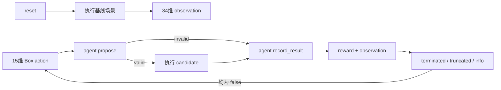

# 对抗性测试代理 Gymnasium 接口评估 V1

_评估日期：2026年8月21日；范围：阶段四场景间对抗性测试代理与低成本训练工程验证_

---

## 📋 评估结论

当前代理契约**已完成 Gymnasium 外壳适配、服务器级接口验证、分层场景采样、四类非学习 CARLA 对照、Stable-Baselines3 训练工程验证和冻结 27 维风险代理接入**。服务器已安装 Stable-Baselines3 `2.9.0`，PPO 与 SAC 均完成短步数 mock 训练和冻结代理训练、模型保存、加载与预测。现有核心逻辑已经具备动作校验、34 维观测、奖励分解、失败终止、重复/步数截断和场景库轮转采样。

本次训练执行器是确定性 mock 风险函数，不读取 CARLA，也不复用冻结风险代理；输出显式记录 `training_plumbing_only`、`carla_connected=false` 和 `supports_policy_effect_claim=false`。因此当前只证明训练代码链路可运行，不能据此声称 PPO/SAC 已学会提高真实风险。

Gymnasium 的当前接口要求 `reset()` 返回 `(observation, info)`，`step()` 返回 `(observation, reward, terminated, truncated, info)`；episode 在任一结束标志为真后必须重新 `reset()`。[^1] 这与当前 `AgentTransition` 的两个独立状态字段可以直接对应。

## 🔄 接口映射

| Gymnasium 项 | 当前项目映射 | 评估结果 |
|---|---|---|
| `action_space` | `Box(low=-1, high=1, shape=(15,), dtype=float32)` | 可直接映射；动作语义已归一化 |
| `observation_space` | `Box(low=0, high=1, shape=(34,), dtype=float32)` | 可直接映射；`build_observation()` 已对风险、事件、碰撞、重复和步数比例做截断归一化 |
| `reset()` | 先执行严格基线，再调用 `agent.reset()` | 可行，但基线失败必须作为 reset 失败处理，不能伪造初始观测 |
| `step(action)` | `propose()` → 外部执行器 → `record_result()` | 可行；无效候选不调用 CARLA 执行器 |
| `terminated` | 无效候选或运行失败且配置要求终止 | 对应任务/安全失败 |
| `truncated` | 重复场景或达到最大步数 | 对应时间/编排边界 |
| `info` | proposal、失败原因、奖励分解、样本 ID、运行目录 | 可用于审计和离线分析，不作为 observation 输入 |

## ⚠️ 关键边界

### 基线执行属于 reset 副作用

当前闭环在第一步动作前必须获得基线实测风险，因此 Gymnasium `reset()` 不是纯内存初始化，而是一次外部场景执行。适配器需要把基线失败转换为明确的 `ResetError` 或可重试的初始化失败，不能返回全零观测继续训练。

### 固定场景不能直接训练

固定场景不能支持跨场景泛化。当前 `record_sampler` 已按生成器和目标风险档轮转，并在分层内平衡天气/危险标签和 Traffic Manager 种子；采样来源、分层、种子和历史风险上下文均写入 `reset info.sampling`。场景库历史风险不会注入本 episode 的 `observed_risk`，`reset()` 仍必须重新执行基线。

### CARLA 执行成本决定验证顺序

适配器已先通过 mock executor 验证 API 状态机，再使用服务器 CARLA 完成单 episode 冒烟。后续仍需单独验证真实 CARLA 的运行失败、超时、路线失败和服务异常是否能稳定落盘。

当前对抗性批次不是只有一个传感器：性能档使用 `RGB + Collision + 逐帧车辆/路线遥测`，其中路线配置将相机设为 `640×360`、`5 Hz`，每个 20 秒场景保存 100 帧 RGB；Depth 和 Semantic 在该档关闭。项目已验证的低频多传感器档会同时启用 RGB、Depth、Semantic 和 Collision，同为 100 帧时传感器目录从约 `21.3 MB` 增加到 `55.5 MB`，约为 `2.6` 倍。当前 `heuristic_v2` 和冻结 27 维代理都不读取图像像素，因此增加 Depth/Semantic 会增强可视证据、深度几何和未来视觉模型输入，但不会自动提高当前风险分的准确性。

完整四策略 CARLA 对照的 60 次运行耗时约 29 分钟，平均约 29 秒/次。当前 PPO/SAC 各 64 步冻结代理冒烟共调用执行器 136 次；若逐次替换为 CARLA，仅这一轮预计约需 66 分钟。若训练 10,000 个动作，按每 8 步重新执行一次基线估算至少需要 11,250 次 CARLA 运行；以当前实测吞吐连续执行约需 91 小时，还不包含失败重试、超参数比较和多随机种子。因此 CARLA 用于训练后独立验收，而不是每个梯度步的在线环境。

### 依赖边界

服务器项目环境 `/home/zhaozirong/software/envs/Carla666-0916` 已安装 Gymnasium `1.3.0`、Stable-Baselines3 `2.9.0` 和 PyTorch `2.12.1+cu126`。本机开发环境仍不要求安装这些可选训练依赖；`requirements-rl-interface.txt` 保持仅含接口依赖，`requirements-rl-training.txt` 单独锁定训练依赖。服务器短训练生成的模型权重保留在服务器输出目录，不纳入 Git。

## 🧭 算法选择建议

当前动作空间是有界连续 `Box`，因此后续首选 **SAC**，并以 PPO 作为对照基线。Stable-Baselines3 将 SAC 定位为连续动作算法，且其自定义环境流程要求实现 Gymnasium 接口并运行 `check_env()`。[^2][^3]

这只是接口适配与工程可运行性结论，不代表 SAC/PPO 已经适合当前数据规模，也不代表已经证明策略能发现 SUT 薄弱环节。固定、随机、LHS 和规则引导 LHS 已完成 60 次 CARLA 严格对照；rule-guided LHS 暂作为主要非学习对照。后续训练仍应先使用冻结风险代理近似环境，再由独立 CARLA 小预算评估验证，不能用代理训练回报替代实测结果。

## ✅ 后续验收门

1. 在不改变 `core/adversarial_agent.py` 契约的前提下实现可选 `AdversarialGymEnv` 外壳（已完成，代码位于 `core/adversarial_gym_env.py`）
2. 用 mock executor 验证 `reset/step` 返回值、`Box` 范围、`terminated/truncated` 和 episode 重置（已完成，新增 5 项测试）
3. 在服务器项目环境安装 `requirements-rl-interface.txt`，运行 Gymnasium `check_env`（已完成）
4. 用服务器 CARLA 完成一个基线加两个候选的环境级冒烟，并回收 `info` 与终止状态（已完成）
5. 增加分层场景采样器并完成固定、随机、LHS、规则引导 LHS 的离线候选对照（已完成，见 `docs/adversarial_sampling_baselines_v1.md`）
6. 增加约束感知重采样并准备共享基线与四策略 CARLA 对照计划（已完成）
7. 完成 12 个共享基线和 48 个四策略候选的 `60/60` CARLA 严格对照（已完成）
8. 安装 Stable-Baselines3 `2.9.0`，通过 SB3 `check_env`，完成 PPO/SAC 短训练和模型持久化往返（已完成）
9. 接入冻结的 27 维风险代理，校验模型哈希和特征顺序，完成 PPO/SAC 短训练（已完成）
10. 完成多随机种子代理训练与等预算非学习基线对照（已完成）
11. 冻结 SAC 与 rule-guided LHS 的少量 12 分层 CARLA 独立策略评估（已完成，见 `docs/adversarial_policy_carla_evaluation_v1.md`）

## 📌 当前决策

| 项目 | 当前决定 |
|---|---|
| 是否安装 Gymnasium | 已在服务器项目环境安装 `1.3.0` |
| 是否安装 Stable-Baselines3 | 已在服务器项目环境固定 `2.9.0` |
| 是否启动训练 | 已完成 PPO/SAC 各 3 个种子、每模型 4096 步冻结代理训练；不启动 CARLA 在线训练 |
| 当前阶段结果 | 12 分层、36 次 CARLA 独立评估 `36/36` 严格通过；仅支持本轮成对描述，不支持普遍策略优势 |
| 下一项代码工作 | 扩展独立场景与重复种子统计口径，不启动 CARLA 在线训练 |
| 真实 CARLA 要求 | 服务器优先，仍使用 CARLA 0.9.16 与 `Carla666-0916` |

## ✅ 已执行验证

2026-08-20 服务器任务 `check-adversarial-gymnasium_20260820_214522` 使用 Gymnasium `1.3.0` 通过标准 `check_env`。mock executor 验证了观测 `(34,)`、动作 `(15,)`、`float32` 类型、首次 step 返回和非终止状态；该任务不连接 CARLA。Gymnasium 检查器仅提示环境未通过 `gymnasium.make()` 注册，因而不检查备用渲染模式；项目环境没有渲染需求，该提示不影响接口检查。

服务器旧全量 `unittest` 任务 `server-gymnasium-full-tests_20260820_214610` 曾因缺少 `matplotlib` 失败。该依赖已按 `3.11.0` 写入 `requirements-models.txt` 并安装，`pip check` 无冲突；2026-08-21 任务 `server-sb3-full-tests-fixed_20260821_165638` 已完成服务器全量 `60/60` 测试，另有 1 项仅在 Gymnasium 缺失时运行的测试按预期跳过。

2026-08-20 服务器任务 `adversarial-gymnasium-smoke-v1_20260820_215156` 完成真实 CARLA 环境冒烟：Gymnasium `1.3.0` 执行一次 `reset()` 基线和两次 `step()` 候选，`3/3` 次严格验收通过。风险序列为 `27.764 → 28.899 → 30.353`；三次均无碰撞、RGB 各 `100` 帧、路线双车在途率 `1.0`、CARLA 服务健康、客户端/服务端均为 `0.9.16`，两次返回均为 `terminated=false`、`truncated=false`。当时记录的 transition reward `0.21135/0.21454` 使用旧的绝对事件奖励语义，只保留为历史链路证据，不与 2026-08-21 冻结的 `relative_capped_delta` reward V2 直接比较。证据目录：`F:\Carla\project-transfer\server-results\20260820_215156_20260820_215411`。该证据只证明环境外壳与真实 executor 的闭环回填可用，不支持策略学习或 RL 有效性结论。

2026-08-21 完成分层采样、四类离线基线和独立重试动作流：24 个独立场景覆盖全部 12 个“生成器 × 目标风险档”组合，三个 Traffic Manager 种子各 8 次；fixed/random/LHS/rule-guided LHS 原始首轮有效数为 `24/21/21/22`，额外使用 `0/3/3/2` 次动作后四组均补齐 `24/24`，没有重试预算耗尽。最终离线结果目录为 `F:\Carla\output-0.9.16\adversarial_baselines_v1\20260821_132033`。候选未运行 CARLA，因此不能把约束有效率解释为风险提升率。

同日完成一个 12 分层周期的 CARLA 对照：12 个共享基线加 48 个四策略候选，共 `60/60` 次严格验收通过。rule-guided LHS 在 `10/12` 个 pair 风险升高、`8/12` 次取得四策略最高风险，中位风险增量 `+2.045`；当前仅将其作为主要非学习对照，不声称普遍优势。轻量结果位于 `F:\Carla\project-transfer\server-results\20260821_152924_20260821_155826`。

2026-08-21 服务器任务 `adversarial-sb3-smoke-v1_20260821_165303` 使用 Python `3.12.13`、Gymnasium `1.3.0`、Stable-Baselines3 `2.9.0` 和 PyTorch `2.12.1+cu126` 完成训练工程冒烟。Gymnasium 与 SB3 两套 `check_env` 均通过；PPO 与 SAC 各训练 `64` 步，模型均成功保存、重新加载并产生合法候选预测。结构化摘要回收至 `F:\Carla\project-transfer\server-results\20260821_165304_20260821_165402\training_summary.json`。该任务没有连接 CARLA，PPO/SAC 的单次预测 reward 不用于策略效果比较。

同日服务器任务 `adversarial-sb3-proxy-smoke-v1_20260821_172514` 接入冻结的 V5 物理增强随机森林：模型 SHA-256 `26dd5f56fc3c556cb9691ac2c2922b0ebd44a94f0910452f3bfc92c90153c188`、27 维特征契约和两套 `check_env` 全部通过。PPO/SAC 各训练 `64` 步并完成模型持久化，预测候选代理分分别为 `52.411` 和 `50.940`。代理只预测连续风险分，训练配置将碰撞和事件奖励设为 `0`；摘要位于 `F:\Carla\project-transfer\server-results\20260821_172515_20260821_172622\proxy_training_summary.json`。该结果只支持 `proxy_environment_only` 结论，仍需 CARLA 独立评估。

服务器任务 `adversarial-sb3-proxy-benchmark-v1_20260821_175339` 随后完成 PPO/SAC 各 3 个种子、每模型 `4096` 步的正式代理基准。SAC 的跨种子平均风险增量为 `+0.808`，rule-guided LHS 为 `+0.910`；SAC 相对 rule-guided LHS 为 `19` 胜 `53` 负，但相对 fixed、random 和 LHS 分别为 `45/27`、`55/17` 和 `47/25`。因此 SAC 进入 CARLA 独立验收，rule-guided LHS 保持主要非学习对照，PPO 暂不进入。详细设计、边界和结果见 `docs/adversarial_proxy_benchmark_v1.md`。

2026-08-21 完成冻结 SAC 与 rule-guided LHS 的 CARLA 独立评估：使用新的 12 分层集合、12 个共享基线和 24 个候选，共 `36/36` 条运行严格验收通过。SAC 平均风险增量 `-2.017`、中位数 `+0.786`、风险升高 `8/12`；rule-guided LHS 平均风险增量 `-4.359`、中位数 `+0.241`、风险升高 `6/12`。共享基线碰撞 `3/12`，SAC 候选碰撞 `2/12`（新增 `0`、消除 `1`），rule-guided LHS 候选碰撞 `2/12`（新增 `1`、消除 `2`）。所有运行均满足 CARLA `0.9.16` 版本匹配、RGB 100 帧、路线、服务健康和 `heuristic_v2` 风险方法门；结果只支持本轮 12 个独立 pair 的描述性结论。完整报告见 `docs/adversarial_policy_carla_evaluation_v1.md`，轻量证据目录为 `F:\Carla\project-transfer\server-results\adversarial_policy_carla_full_v1_20260821_202710`。

[^1]: Gymnasium. “Env API.” https://gymnasium.farama.org/api/env/
[^2]: Stable-Baselines3. “Using Custom Environments.” https://stable-baselines3.readthedocs.io/en/master/guide/custom_env.html
[^3]: Stable-Baselines3. “SAC.” https://stable-baselines3.readthedocs.io/en/master/modules/sac.html
