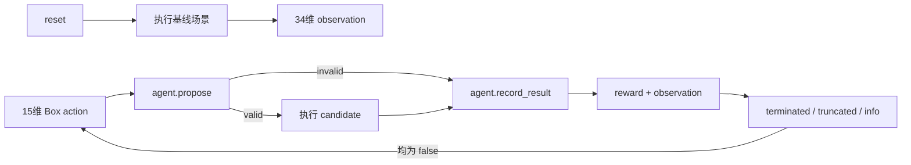

# 对抗性测试代理 Gymnasium 接口评估 V1

_评估日期：2026年8月21日；范围：阶段四场景间对抗性测试代理，不启动 RL 训练_

---

## 📋 评估结论

当前代理契约**已完成 Gymnasium 外壳适配、服务器级接口验证、分层场景采样和训练前离线基线对照**，但仍未安装 Stable-Baselines3，也不启动训练。现有核心逻辑已经具备动作校验、34 维观测、奖励分解、失败终止、重复/步数截断和场景库轮转采样。

Gymnasium 的当前接口要求 `reset()` 返回 `(observation, info)`，`step()` 返回 `(observation, reward, terminated, truncated, info)`；episode 在任一结束标志为真后必须重新 `reset()`。[^1] 这与当前 `AgentTransition` 的两个独立状态字段可以直接对应。

## 🔄 接口映射

| Gymnasium 项 | 当前项目映射 | 评估结果 |
|---|---|---|
| `action_space` | `Box(low=-1, high=1, shape=(15,), dtype=float32)` | 可直接映射；动作语义已归一化 |
| `observation_space` | `Box(low=0, high=1, shape=(34,), dtype=float32)` | 可直接映射；`build_observation()` 已对风险、事件、碰撞、重复和步数比例做截断归一化 |
| `reset()` | 先执行严格基线，再调用 `agent.reset()` | 可行，但基线失败必须作为 reset 失败处理，不能伪造初始观测 |
| `step(action)` | `propose()` → 外部执行器 → `record_result()` | 可行；无效候选不调用 CARLA 执行器 |
| `terminated` | 无效候选或运行失败且配置要求终止 | 对应任务/安全失败 |
| `truncated` | 重复场景或达到最大步数 | 对应时间/编排边界 |
| `info` | proposal、失败原因、奖励分解、样本 ID、运行目录 | 可用于审计和离线分析，不作为 observation 输入 |

## ⚠️ 关键边界

### 基线执行属于 reset 副作用

当前闭环在第一步动作前必须获得基线实测风险，因此 Gymnasium `reset()` 不是纯内存初始化，而是一次外部场景执行。适配器需要把基线失败转换为明确的 `ResetError` 或可重试的初始化失败，不能返回全零观测继续训练。

### 固定场景不能直接训练

固定场景不能支持跨场景泛化。当前 `record_sampler` 已按生成器和目标风险档轮转，并在分层内平衡天气/危险标签和 Traffic Manager 种子；采样来源、分层、种子和历史风险上下文均写入 `reset info.sampling`。场景库历史风险不会注入本 episode 的 `observed_risk`，`reset()` 仍必须重新执行基线。

### CARLA 执行成本决定验证顺序

适配器已先通过 mock executor 验证 API 状态机，再使用服务器 CARLA 完成单 episode 冒烟。后续仍需单独验证真实 CARLA 的运行失败、超时、路线失败和服务异常是否能稳定落盘。

### 依赖边界

服务器项目环境 `/home/zhaozirong/software/envs/Carla666-0916` 已安装 Gymnasium `1.3.0`；本机开发环境仍不要求安装该可选依赖。Stable-Baselines3 尚未安装，不生成模型权重。

## 🧭 算法选择建议

当前动作空间是有界连续 `Box`，因此后续首选 **SAC**，并以 PPO 作为对照基线。Stable-Baselines3 将 SAC 定位为连续动作算法，且其自定义环境流程要求实现 Gymnasium 接口并运行 `check_env()`。[^2][^3]

这只是接口适配建议，不代表 SAC/PPO 已经适合当前数据规模，也不代表已经证明策略能发现 SUT 薄弱环节。固定、随机、LHS 和规则引导 LHS 的首轮离线候选对照已经完成，但尚未比较 CARLA 实测奖励，因此仍不能启动正式训练。

## ✅ 后续验收门

1. 在不改变 `core/adversarial_agent.py` 契约的前提下实现可选 `AdversarialGymEnv` 外壳（已完成，代码位于 `core/adversarial_gym_env.py`）
2. 用 mock executor 验证 `reset/step` 返回值、`Box` 范围、`terminated/truncated` 和 episode 重置（已完成，新增 5 项测试）
3. 在服务器项目环境安装 `requirements-rl-interface.txt`，运行 Gymnasium `check_env`（已完成）；Stable-Baselines3 仍不安装
4. 用服务器 CARLA 完成一个基线加两个候选的环境级冒烟，并回收 `info` 与终止状态（已完成）
5. 增加分层场景采样器并完成固定、随机、LHS、规则引导 LHS 的离线候选对照（已完成，见 `docs/adversarial_sampling_baselines_v1.md`）
6. 增加约束感知重采样并准备共享基线与四策略 CARLA 对照计划（已完成静态计划，尚未实机）
7. 服务器执行单 pair 的 1 基线 + 4 候选冒烟；通过后再决定完整对照和 Stable-Baselines3

## 📌 当前决策

| 项目 | 当前决定 |
|---|---|
| 是否安装 Gymnasium | 已在服务器项目环境安装 `1.3.0` |
| 是否立即安装 Stable-Baselines3 | 否，先完成单 pair 真实 CARLA 基线冒烟 |
| 是否启动训练 | 否 |
| 下一项代码工作 | CARLA 计划执行与结果聚合入口 |
| 真实 CARLA 要求 | 服务器优先，仍使用 CARLA 0.9.16 与 `Carla666-0916` |

## ✅ 已执行验证

2026-08-20 服务器任务 `check-adversarial-gymnasium_20260820_214522` 使用 Gymnasium `1.3.0` 通过标准 `check_env`。mock executor 验证了观测 `(34,)`、动作 `(15,)`、`float32` 类型、首次 step 返回和非终止状态；该任务不连接 CARLA。Gymnasium 检查器仅提示环境未通过 `gymnasium.make()` 注册，因而不检查备用渲染模式；项目环境没有渲染需求，该提示不影响接口检查。

服务器全量 `unittest` 任务 `server-gymnasium-full-tests_20260820_214610` 未通过，原因是既有场景库分析测试导入 `matplotlib`，而服务器项目环境尚未安装该非本任务依赖。失败发生在 `analysis/analyze_scenario_library.py --validate-only`，不涉及 Gymnasium 适配；本机加入分层采样与约束重试测试后全量 `51/51` 通过，服务器 Gymnasium 专项检查已独立通过。

2026-08-20 服务器任务 `adversarial-gymnasium-smoke-v1_20260820_215156` 完成真实 CARLA 环境冒烟：Gymnasium `1.3.0` 执行一次 `reset()` 基线和两次 `step()` 候选，`3/3` 次严格验收通过。风险序列为 `27.764 → 28.899 → 30.353`；三次均无碰撞、RGB 各 `100` 帧、路线双车在途率 `1.0`、CARLA 服务健康、客户端/服务端均为 `0.9.16`，两次返回均为 `terminated=false`、`truncated=false`。当时记录的 transition reward `0.21135/0.21454` 使用旧的绝对事件奖励语义，只保留为历史链路证据，不与 2026-08-21 冻结的 `relative_capped_delta` reward V2 直接比较。证据目录：`F:\Carla\project-transfer\server-results\20260820_215156_20260820_215411`。该证据只证明环境外壳与真实 executor 的闭环回填可用，不支持策略学习或 RL 有效性结论。

2026-08-21 完成分层采样、四类离线基线和独立重试动作流：24 个独立场景覆盖全部 12 个“生成器 × 目标风险档”组合，三个 Traffic Manager 种子各 8 次；fixed/random/LHS/rule-guided LHS 原始首轮有效数为 `24/21/21/22`，额外使用 `0/3/3/2` 次动作后四组均补齐 `24/24`，没有重试预算耗尽。最终离线结果目录为 `F:\Carla\output-0.9.16\adversarial_baselines_v1\20260821_132033`。候选未运行 CARLA，因此不能把约束有效率解释为风险提升率。

同日完成一个 12 分层周期的 CARLA 静态对照计划：12 个共享基线加 48 个四策略候选，共 `60` 个计划运行，60/60 场景与配置通过 Scene 04 `--validate-only`。计划目录为 `F:\Carla\output-0.9.16\adversarial_baseline_carla_plan_v1\20260821_132000`。该结果未连接 CARLA，不构成真实风险、奖励或严格运行验收证据。

[^1]: Gymnasium. “Env API.” https://gymnasium.farama.org/api/env/
[^2]: Stable-Baselines3. “Using Custom Environments.” https://stable-baselines3.readthedocs.io/en/master/guide/custom_env.html
[^3]: Stable-Baselines3. “SAC.” https://stable-baselines3.readthedocs.io/en/master/modules/sac.html
