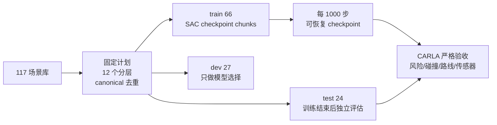

# CARLA 在线 RL 多场景泛化准备 V1

## 🧭 目标与边界

本准备链路把在线 RL 从“单条记录冒烟”提升为可复现的多场景实验协议：先冻结场景划分，再让训练只读取 `train`，模型选择使用 `dev`，最后只在独立 `test` 上做一次结果验收。生成计划、训练和评估均显式记录 CARLA `0.9.16`、算法、随机种子、计划哈希和 checkpoint。

这不是训练完成证明。代理训练、静态校验和 dry-run 不能替代真实 CARLA；只有服务器上的真实运行结果才能支持风险、碰撞、传感器和路线结论。



## 📐 固定计划

当前本地生成的计划使用 `seed=20260824`，来源为场景库 `117` 条独立记录：

| split | 条数 | 用途 |
|---|---:|---|
| train | 66 | 允许产生梯度更新和训练 reward |
| dev | 27 | 仅用于选择 checkpoint 或超参数，不参与最终报告样本 |
| test | 24 | 训练结束后才打开，作为独立泛化评估 |

12 个 `generator × target_risk_level` 分层均有三份 split。`canonical_sample_id` 和 `scenario_hash` 均做跨 split 泄漏检查；计划文件自身带 `plan_sha256`，内容被修改后训练入口会拒绝执行。

生成入口：

```bash
python tools/prepare_carla_rl_multiscene_plan.py \
  --output /path/to/carla_rl_multiscene_plan_v1.json \
  --seed 20260824
```

## 🧪 训练协议

主线选择 **SAC**，因为当前动作空间是连续有界 Box；PPO 作为同预算对照，而不是默认主线。第一阶段不把 frozen proxy 结果写成 CARLA 策略效果。

推荐顺序：

1. 先运行 `256` 步 SAC canary，确认 Gymnasium、SB3、CARLA、端口、GPU1 和输出清理都正常。
2. canary 通过后运行 `10,000` 步 SAC，按 `10 × 1,000` 步保存 checkpoint。
3. 断线或服务器重启时，从最后一个 `.zip` checkpoint 执行 `resume`，已经完成的 chunk 不重算。
4. 训练完成后才运行独立 `test` 评估；`dev` 只在需要选择 checkpoint 时使用。

10,000 步按环境最多 16 个候选动作估算为约 `10,625` 次 CARLA 场景执行（每个 episode 另有一次 baseline）；按既有约 `29 秒/次` 的服务器观测，基础运行约 `86 小时`，实际应按 `4 天左右` 预留，并考虑失败重试、启动清理和服务器维护。该估算是单算法、单种子，不是已完成的运行结果。

## 🖥️ 服务器一键入口

底层参数化脚本为 `tools/server_jobs/carla_rl_multiscene_v1.sh`。面向实际操作的入口已按阶段拆开；CARLA 阶段会先启动或复用服务器 CARLA，再通过 `server_run.ps1` 提交到独立 tmux。提交命令返回后训练继续运行，SSH 或本机终端断开不会结束服务器任务。

| 阶段 | Windows 入口 | 行为 |
|---|---|---|
| 00 | `tools/server_carla_rl_00_prepare_v1.cmd` | CPU 生成并校验固定计划；canary 缺计划时也会自动执行 |
| 01 | `tools/server_carla_rl_01_canary_sac_256_v1.cmd` | 后台运行 SAC 256 步并执行严格质量门 |
| 02 | `tools/server_carla_rl_02_train_sac_10000_v1.cmd` | 后台运行 10,000 步；发现已有 checkpoint 时拒绝覆盖 |
| 03 | `tools/server_carla_rl_03_resume_sac_10000_v1.cmd` | 自动定位已登记的最新 checkpoint 并恢复到 10,000 步 |
| 04 | `tools/server_carla_rl_04_evaluate_dev_v1.cmd` | 在冻结 dev split 上运行最终模型，供人工复核 |
| 05 | `tools/server_carla_rl_05_evaluate_test_v1.cmd` | 仅在 dev 结果存在后运行冻结 test split |

阶段 01 和阶段 02 完成后，`tools/check_carla_rl_training.py` 会核对训练状态、准确步数、最终模型、checkpoint、只使用 train split、所有 CARLA 执行的严格验收、服务健康和客户端/服务端 `0.9.16`。默认模式审计输出目录内全部 episode；当同一目录包含断点恢复前的历史运行时，历史失败会继续保留在 `quality_gate.json`，不能被新运行覆盖。阶段 03 恢复入口同时读取当前 `run_manifest.json` 的 `episode_id`，生成 `quality_gate_current_episode.json`，并以当前 episode 的质量门作为远程任务退出依据。

也可以手动按 episode 审计既有结果：

```bash
python -u tools/check_carla_rl_training.py \
  --output-root /path/to/sac_seed_20260824_10000 \
  --expected-algorithm SAC --expected-steps 10000 \
  --episode-id <episode-id> \
  --output /path/to/sac_seed_20260824_10000/quality_gate_current_episode.json
```

按 episode 审计只改变统计范围，不删除、修改或重新解释历史 `execution_result.json`；只有当前 episode 门通过后，才可进入 dev/test 评估。

训练目录会包含：

| 文件 | 作用 |
|---|---|
| `run_manifest.json` | 算法、种子、计划哈希、CARLA 版本、运行状态 |
| `checkpoint_manifest.json` | 每个 chunk 的步数、checkpoint 路径和存在性 |
| `models/*.zip` | 可恢复 checkpoint；不提交 Git |
| `rl_training_summary.json` | 完成步数、采样覆盖和证据等级 |
| `test_evaluation_summary.json` | 独立 test 运行的逐场景摘要 |
| `quality_gate.json` | 输出目录内全部 episode 的历史/全量质量门及失败项 |
| `quality_gate_current_episode.json` | 恢复入口按当前训练 episode 单独审计的质量门；不覆盖全量历史结果 |

原始传感器帧和模型权重只保留在服务器输出目录，结果回收时优先回收 JSON/CSV/Markdown 汇总，不在本机长期保存安装包或原始大文件。

## 🚦 质量门

训练任务只有在以下条件全部满足后才进入独立评估：

- 计划哈希校验通过，train/dev/test 无 canonical ID 或场景哈希重叠；
- 服务器 Python、CARLA 客户端/服务端均为 `0.9.16`；
- 所有 checkpoint 的 `exists=true`，最终 `trained_num_timesteps=10000`；
- 每个实际 CARLA 运行的传感器、服务健康、路线和 `heuristic_v2` 元数据可回溯；
- 训练失败时保留 `run_manifest.json` 的失败状态，不自动把失败结果拼接进后续统计。
- 断点恢复时同时保留全量历史门和当前 episode 门；历史失败不得通过删除记录或放宽阈值消除。

即使质量门通过，也只能说明该固定场景集合上的可复现运行和独立比较；不能直接宣称 SAC 普遍优于 PPO、风险代理等价于实测风险，或跨地图泛化已经完成。
