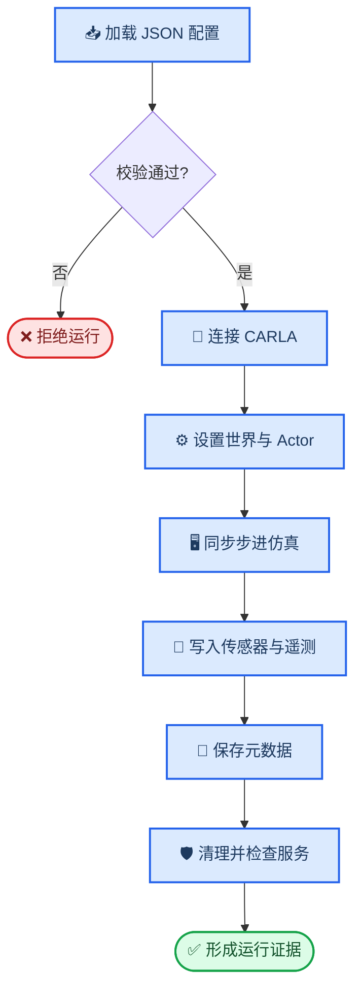

# 软著系统接口规格 V1（M01–M08）

_项目：基于 CARLA 的自动驾驶极端场景生成与仿真测试系统 V1.0；配套模块映射：`docs/software_copyright_module_mapping_v1.md`；更新日期：2026-08-23_

---

> **文档定位：** 本文固化 M01–M08 的现有命令入口、核心函数、数据契约、输出物和验收条件，作为软件说明书和后续系统集成的工程底稿。本文只记录当前代码已经提供或已经验证的接口。

## 📋 接口原则

### 统一调用方式

- **代码接口：** Python 模块之间通过字典、列表、JSON 配置和 CSV 遥测传递数据。
- **命令接口：** 生成、构建、查询、仿真和批次任务通过 Python CLI 或 `.cmd` 入口调用。
- **路径规则：** 项目代码和轻量证据位于仓库；CARLA 原始帧、模型权重和服务器大文件位于 `F:\` 或服务器输出目录，不进入 Git。
- **状态规则：** 静态校验通过不代表 CARLA 运行成功；运行结果必须结合 `metadata.json`、传感器状态、路线验收和 CARLA 服务健康状态判断。
- **标签规则：** `target_risk_level` 表示生成条件，`observed_risk` 表示仿真测量结果，两者不得混用。

### 模块接口总览

| 模块 | 主入口 | 输入 | 输出 | 当前状态 |
| --- | --- | --- | --- | --- |
| M01 | `generate_seed_dataset.py`、`generate_with_model.py`、`run_diffusion_comparison.py` | 条件、生成器、种子、模型工件 | 场景 JSON/JSONL、统一离线评估报告 | 已验证实现 / 原型 |
| M02 | `scenario_validator.py`、`physical_constraints.py`、`check_physical_constraints.py` | 场景记录、Schema、基础配置 | Schema/语义校验、参数级物理约束结果、编译配置、JSON 报告 | 已验证实现 |
| M03 | `build_scenario_library.py`、`query_scenario_library.py`、`core/scenario_query.py` | 来源清单、运行证据、质量门、结构化查询条件 | 场景库、索引、受控查询结果 | 已验证实现 |
| M04 | `scene_04_parameterized.py`、`batch_runner.py` | JSON 配置、CARLA 服务、运行参数 | `metadata.json`、`telemetry.csv`、传感器帧 | 已验证实现 / 原型 |
| M05 | `risk_metrics.py`、`analysis/` | 遥测、事件、运行元数据 | 风险分数、等级、分析报告 | 已验证实现 |
| M06 | `batch_runner.py`、`core/web_task_orchestrator.py`、`tools/server_*.cmd` | 实验计划、Git 提交、服务器资源或 Web 任务请求 | 批次汇总、日志、轻量结果、任务状态/结果 JSON | 已验证实现 / 原型 |
| M07 | `web_app.py`、`web_app.cmd`、`scenario_dashboard.py`、`scenario_dashboard.cmd` | 场景库索引、条目、汇总和任务状态 | Web 页面、筛选结果、详情页、生成/校验/风险分析表单、任务状态/结果、健康检查 | 首期 Web 工作流 |
| M08 | `stage5_minimal_demo.py`、`stage5_demo.cmd` | M01 记录、M03 库、M02 基础配置 | 静态配置、`.xosc`、适配清单、`demo_manifest.json` | 已验证实现 / 离线原型 |

## ⚙️ 数据契约

### 场景生成记录

M01 输出必须符合 `schemas/generated_scenario.schema.json`，核心字段如下：

| 字段组 | 关键字段 | 说明 |
| --- | --- | --- |
| 标识 | `sample_id`、`family`、`schema_version` | 样本唯一标识和记录版本 |
| 条件 | `target_risk_level`、`weather_tags`、`hazard_tags` | 生成条件，不是实测结论 |
| 场景 | `duration_seconds`、`traffic_manager_seed` | 仿真时长和交通种子 |
| 天气 | `cloudiness`、`precipitation`、`fog_density`、`sun_altitude_angle` 等 | CARLA 天气参数 |
| 危险行为 | `lead_vehicle`、`pedestrian` | 前车急刹和行人横穿参数 |
| 实测结果 | `observed_risk.status`、`score`、`level`、`run_dir` | 未仿真时允许为空 |
| 血缘 | `provenance` | 生成器、种子、数据划分和创建时间 |

### 场景库条目

M03 输出必须符合 `schemas/scenario_library_entry.schema.json`，以 `scenario_hash` 作为 15 维参数规范化后的内容身份。条目同时保存 `provenance`、`execution_evidence`、`observed_risk` 和 `quality`，因此可以从一个独立场景追溯到来源、运行证据和质量分层。

### CARLA 运行证据

M04 的一次运行目录至少包含以下轻量证据：

| 文件 | 主要内容 | 消费模块 |
| --- | --- | --- |
| `config_snapshot.json` | 本次运行使用的配置快照 | M04、M06 |
| `metadata.json` | 运行状态、事件、帧数、风险结果、路线和服务状态 | M03、M05、M06 |
| `telemetry.csv` | 逐帧速度、间距、TTC、行人距离和控制诊断 | M05 |
| `batch_summary.csv` | 批次级成功、失败、风险和传感器汇总 | M06 |
| 传感器目录 | RGB、Depth、SemSeg、Collision 等原始或低频证据 | M04、后续视觉模块 |

### 运行可信条件

运行结果按以下顺序判定，不能只看命令是否退出：

1. 配置通过 M02 静态校验。
2. `metadata.json` 的运行状态为 `completed`。
3. 传感器写盘状态为 `completed`，帧数达到该配置的预期值。
4. 需要路线控制时，主车、前车和双车同时在途率达到质量门要求。
5. CARLA 服务健康检查为 `healthy`。
6. M05 才能使用该运行的 `observed_risk` 更新场景库或风险反馈数据集。

## 🔧 M01 场景生成接口

### 命令入口

| 用途 | 命令 |
| --- | --- |
| 生成平衡种子数据集 | `python tools\generate_seed_dataset.py --output-dir <dir> --count-per-level 64 --seed <seed>` |
| 统一生成 LHS/GMM/CVAE/Diffusion 样本 | `python tools\generate_with_model.py --model <lhs|gmm|cvae|diffusion> --risk <level> --count <N> --seed <seed> --output <path>` |
| 指定 GMM、CVAE 或 Diffusion 工件 | 在统一生成命令中追加 `--artifact <path>` |
| 四生成器小规模对照 | `tools\run_diffusion_comparison.cmd --device cpu --output-dir artifacts\diffusion_comparison_v1` |

### 代码接口

- `ConditionalGMM.fit(records)`：从训练记录估计条件分布。
- `ConditionalGMM.sample(target_risk_level, count, random_seed=None)`：按目标档生成参数样本。
- `ConditionalTabularCVAE.sample(conditions, generator=None)`：从条件和潜变量生成标准化特征。
- `ConditionalTabularDiffusion.sample(conditions, generator=None)`：按条件执行轻量 DDPM 反向采样，输出标准化特征。
- `cvae_loss(reconstruction, features, mu, log_variance, beta)`：计算 CVAE 训练损失。
- `ConditionalTabularDiffusion.diffusion_loss(features, conditions)`：计算噪声预测训练损失。
- `training.scenario_dataset.ScenarioDataset.from_jsonl(path)`：读取 JSONL 训练记录。

### 输入输出与错误边界

- 输入必须提供风险档和随机种子；GMM/CVAE 推理必须提供对应模型工件。
- 输出必须经过 M02 校验后才可进入场景库或 CARLA 运行。
- 生成器失败、模型工件缺失、样本无法满足约束时，调用方应保留失败日志，不把失败样本写入正式库。
- 生成模型的目标档命中率必须由 CARLA 实测 `observed_risk` 统计，不能由生成器输出字段直接推断。
- Diffusion 的风险档设计区间投影只保证参数级可行域，不保证 CARLA Actor、路线或传感器运行成功。

## 🛡️ M02 场景约束接口

### 代码接口

- `validate_scenario_record(record, schema=None, schema_path=...)`：返回结构校验和语义校验结果。
- `require_valid_scenario(record, schema=None, schema_path=...)`：校验失败时阻止后续处理。
- `derive_weather_tags(weather)`：从天气参数推导标准天气标签。
- `compile_carla_config(record, base_config)`：将生成记录合并到基础 Scene 04 配置。
- `rebase_output_root(config, base_config_path, destination_config_path)`：将输出目录重定位到目标实验目录。

### 校验层次

| 层次 | 检查内容 | 失败后果 |
| --- | --- | --- |
| Schema | 类型、必需字段、枚举、数值范围、额外字段 | 拒绝记录 |
| 语义 | 天气标签与参数、危险行为组合、时间关系 | 拒绝或产生警告 |
| 编译 | 生成字段能否覆盖基础 CARLA 配置 | 不生成运行配置 |
| 实机 | Actor、路线、传感器和服务能否完成运行 | 由 M04 严格验收 |

### 证据边界

M02 只负责“记录和配置是否合法”。`--validate-only` 只能证明静态契约，不证明 CARLA 服务在线、传感器能写盘或路线能执行。

## 💾 M03 场景库接口

### 命令入口

| 用途 | 命令 |
| --- | --- |
| 构建场景库 | `python tools\build_scenario_library.py --sources <sources.json> --schema <schema.json> --output-dir <dir>` |
| 只校验构建输入 | 在构建命令后追加 `--validate-only` |
| 查询高风险碰撞场景 | `python tools\query_scenario_library.py --collision yes --sort risk_desc --limit 5 --format jsonl` |
| 导出 CSV | 在查询命令后追加 `--format csv --output <path>` |
| 受控条件/关键词查询 | `python tools\query_scenario_library.py --target-risk high --weather-tag night --keyword lhs --limit 5` |
| Web 受控查询 API | `GET /api/scenarios/search?target_risk=high&weather_tag=night&keyword=lhs&limit=3` |

### 代码接口

- `build_library_entries(source_config, schema, project_root)`：收集来源并生成独立条目。
- `scenario_identity_payload(record)`：提取用于身份判定的参数载荷。
- `normalized_parameter_vector(record)`：生成归一化参数向量。
- `normalized_distance(left, right)`：计算场景间参数距离。
- `collect_source_records(source_config, project_root)`：读取运行级或聚合级来源。

### 质量处理

- 通过参数内容哈希去重，不以 `sample_id` 单独判定独立性。
- 聚合 `execution_evidence`、`observed_risk` 和 `quality`，保留来源文件哈希。
- 质量门当前冻结为 117 个独立场景和 351 次来源批次严格验收运行；36 个条目为 `direct_run_evidence`，81 个条目为 `inherited_batch_acceptance` 聚合证据，真实性仍为 `not_assessed`。
- 查询只读取已构建索引，不重新运行 CARLA，也不修改场景库条目。
- `core.scenario_query` 统一执行枚举、范围、标签和白名单关键词过滤；关键词不解析自然语言，多个关键词按 AND 组合。
- `target_risk` 是设计条件，`observed_risk` 是历史实测标签；查询响应保留两者的字段边界。

## 🖥️ M04 仿真与采集接口

### 命令入口

| 用途 | 命令 |
| --- | --- |
| 单场景静态校验 | `python scenes\scene_04_parameterized.py --config <config.json> --validate-only` |
| 单场景实机运行 | `python scenes\scene_04_parameterized.py --config <config.json>` |
| 指定输出根目录 | 在运行命令后追加 `--output-root <dir>` |
| 批次运行 | `python batch_runner.py --config <batch.json> --limit <N> --repeat <N>` |
| 批次静态校验 | `python batch_runner.py --config <batch.json> --validate-only` |
| 自定义 JSON 适配静态校验 | `python tools\convert_scenario_to_openscenario.py --input <record.json> --validate-only` |
| 生成 OpenSCENARIO 与 CARLA 配置 | `python tools\convert_scenario_to_openscenario.py --input <record.json> --output-dir <dir>` |

### 运行流程

### 运行输出

- `metadata.json`：运行状态、地图、CARLA 版本、Actor、事件、帧数、风险、路线控制、清理结果和服务健康。
- `telemetry.csv`：逐帧车辆状态、TTC、车距、行人距离、控制量、路线匹配和控制原因。
- `sensor_pipeline`：传感器监听、队列、写盘完成状态和各传感器帧数。
- 运行失败必须保留 `metadata.json` 和错误字段，禁止只输出终端错误后丢弃证据。

### OpenSCENARIO/CARLA 最小适配 V1

- 自定义 JSON 仍是工程事实源；适配器版本为 `custom_json_to_openscenario_carla_v1`。
- 当前只生成 OpenSCENARIO XML 1.0 的实体、相对初始位置、仿真时间触发器和停止触发器。
- 天气、传感器、Traffic Manager、风险算法、路线控制器和输出目录继续由编译后的 CARLA JSON 负责；条件、实测风险和来源血缘保留在适配清单中。
- 每次转换必须同时生成 `.xosc`、`.carla.json` 和 `.adapter_manifest.json`，清单保存源记录、基础配置、映射和 XOSC 哈希。
- 适配器的 `--validate-only` 只证明静态结构和字段覆盖，不证明 ScenarioRunner 可执行、自定义行人命令可用或 CARLA 实机验收通过。
- 已有一次 CARLA JSON 运行时冒烟证据：客户端/服务端 `0.9.16` 匹配，20 秒同步运行完成，RGB/Depth/Semantic 各 `200` 帧，服务健康；路线控制未启用，因此不计为路线严格验收。
- 详细边界见 `docs/openscenario_carla_adapter_v1.md`，版本化映射见 `configs/openscenario_adapter_v1.json`。

## 📊 M05 风险评估接口

### 代码接口

- `calculate_ttc(ego_transform, ego_velocity, lead_transform, lead_velocity, vehicle_length)`：计算净间距、闭合速度和 TTC。
- `evaluate_risk_v2(telemetry_rows, parameters, risk_config, events=None, collision_count=0)`：按启发式 V2 计算风险分数、等级和分量。
- `evaluate_telemetry_risk(telemetry_rows, parameters, risk_config, events=None, collision_count=0)`：从运行遥测统一调用风险评估。
- `write_telemetry_csv(path, rows)`：将逐帧遥测写入 CSV。

### 主要输出

风险结果至少包含连续分数、风险等级、TTC/车距/行人距离最小值、碰撞事件影响和分量明细。M05 输出的 `observed_risk` 才能回填到生成记录或场景库。

### 使用边界

- `heuristic_v2` 是当前仿真遥测上的可解释风险指标，不是经过真实事故数据校准的概率模型。
- 代理模型可用于候选预排序和主动补样，不替代 CARLA 实测验收。
- 碰撞倾向通道用于研究诊断和候选筛选，不能直接表述为跨地图或跨控制器的碰撞概率。

## 🔄 M06 实验与复现接口

### 本地入口

- `batch_runner.py`：读取批次配置、生成运行计划、调用 Scene 04、收集日志并写出批次汇总。
- `tools\test_scenario_library.cmd`：执行场景库接口回归。
- `tools\server_sync.cmd`：将已提交代码同步到服务器运行工作区。
- `tools\server_run.cmd`：在服务器提交后台任务并记录任务元数据。
- `tools\server_job_status.cmd`：查询服务器任务状态。
- `tools\server_fetch_results.cmd`：回收轻量汇总，不默认下载大模型、原始帧和 NPY。

### Web 任务编排接口

- `core.web_task_orchestrator.TaskManager.submit(kind, payload)`：提交 `generation`、`validation`、`risk_analysis` 或 `carla` 任务并返回任务状态。
- `TaskManager.get(task_id)`、`list_tasks()`：读取持久化任务状态和结果摘要。
- `TaskManager.confirm(task_id, confirmed)`：处理 CARLA 任务的显式确认；确认只登记 `manual_external`，不启动 CARLA。
- `TaskManager.cancel(task_id)`：取消尚未结束的任务。

HTTP 接口：

| 方法 | 路径 | 返回/行为 |
| --- | --- | --- |
| `GET` | `/api/tasks` | 任务列表和数量 |
| `GET` | `/api/tasks/{task_id}` | 单个任务状态、错误和结果摘要 |
| `GET` | `/api/tasks/{task_id}/result` | 已完成任务结果；未完成返回 HTTP `409` |
| `POST` | `/api/tasks` | 提交任务；成功返回 HTTP `202` |
| `POST` | `/api/tasks/{task_id}/confirm` | `{"confirmed": true/false}`；只适用于 CARLA 任务 |
| `POST` | `/api/tasks/{task_id}/cancel` | 取消任务 |

任务状态至少包括 `queued`、`running`、`completed`、`failed`、`cancelled`、`awaiting_confirmation` 和 `confirmed_manual`。generation、validation、risk_analysis 使用 `offline_cpu`；CARLA 任务使用 `manual_external`，任务结果必须明确 `carla_connected=false` 和 `execution_started=false`，真实执行仍由 `server_run.cmd` 或专用 CARLA 入口承担。

## 📏 S5-CORE-05 计划书指标基线接口

`tools/measure_stage5_metrics.py` 接受生成汇总、CARLA `metadata.json`、参考条件记录和候选记录，输出 `stage5_metrics_baseline_v1` JSON。它只计算生成吞吐、严格验收运行时间代理和显式条件签名覆盖；缺少同口径 baseline 时，相对比较保持 `not_assessed`。详细口径和当前快照见 `docs/stage5_metrics_baseline_v1.md`。

### 复现最小字段

每个实验至少保存：Git 提交哈希、配置快照及哈希、生成器和种子、Traffic Manager 种子、CARLA 版本、输出目录、运行状态和结果汇总。缺少其中任一关键字段时，应降低证据等级而不是补写未知值。

### 资源边界

服务器运行默认使用 CARLA 0.9.16 和 GPU 1；本地只做代码开发、静态检查和轻量回归。服务器模型权重、原始传感器帧和大体积输出不进入 Git。

## 🔍 接口验收矩阵

| 验收项 | 方法 | 通过条件 |
| --- | --- | --- |
| M01 生成契约 | 生成后运行 M02 校验 | JSON Schema 和语义校验通过 |
| M02 编译能力 | `--validate-only` 和配置快照检查 | 生成配置字段完整、输出目录正确 |
| M03 场景库 | `tools\test_scenario_library.cmd` | 5 项接口回归全部通过 |
| M04.1 格式适配 | 适配器 `--validate-only` + XML 结构回归 | 输入、映射、XOSC 结构和 CARLA 配置形状通过 |
| M04 仿真执行 | 单场景 CARLA 实机运行 | 状态完成、传感器写盘完成、服务健康 |
| M05 风险分析 | 检查 `metadata.json` 和离线报告 | 存在 `observed_risk`，指标来源可追溯 |
| M06 复现管理 | 检查批次汇总、服务器任务目录和 Web 任务状态 | 配置、提交、种子、任务状态和结果可关联 |

## 📡 M07 只读可视化接口

### 启动入口

| 用途 | 命令 |
| --- | --- |
| 启动 Web 管理系统并打开浏览器 | `tools\web_app.cmd` |
| 启动兼容的 Dashboard 入口 | `tools\scenario_dashboard.cmd` |
| 只校验 Web 数据加载 | `python tools\web_app.py --validate-only` |
| 指定端口 | `python tools\web_app.py --port 8765 --open` |

### HTTP 接口

| 方法 | 路径 | 返回内容 | 是否写入 |
| --- | --- | --- | --- |
| `GET` | `/` | Dashboard 页面 | 否 |
| `GET` | `/dashboard` | Dashboard 页面别名 | 否 |
| `GET` | `/scenarios` | 场景库列表入口 | 否 |
| `GET` | `/scenarios/{library_id}` | 独立场景详情页 | 否 |
| `GET` | `/api/summary` | 场景库和质量分析汇总 | 否 |
| `GET` | `/api/scenarios` | 场景索引列表 | 否 |
| `GET` | `/api/scenarios/{library_id}` | 单个场景完整条目 | 否 |
| `GET` | `/healthz` | Web 服务状态和数据计数 | 否 |
| `GET` | `/generation` | 场景生成表单、任务轮询和 JSONL 结果 | 生成任务目录 |
| `GET` | `/validation` | JSON/JSONL 校验、物理约束和配置编译表单 | 校验任务目录 |
| `GET` | `/risk` | 运行目录/遥测风险分析表单和诊断结果 | 风险任务目录 |
| `GET` | `/tasks` | Web 任务提交与状态页面 | 任务状态文件 |
| `GET`/`POST` | `/api/tasks...` | 任务提交、状态、结果和显式确认 | 任务目录 JSON |

页面读取场景库只读文件，并通过独立任务目录保存 Web 任务状态；不修改场景库。`/generation`、`/validation` 和 `/risk` 已提供参数表单、任务轮询、终态结果和错误展示；离线任务仅使用本机 CPU worker，CARLA 任务不由 Web 进程启动，必须显式确认并转交外部服务器入口。当前只支持本机访问和单进程服务，尚未提供用户认证、权限管理或多用户部署。

## 🧭 M08 阶段五最小演示编排接口

### 启动入口

| 用途 | 命令 |
| --- | --- |
| 运行离线最小演示 | `tools\stage5_demo.cmd` |
| 指定输入和输出 | `tools\stage5_demo.cmd --record <record.json> --output-dir <dir>` |
| 直接调用 Python | `D:\ANACONDA\envs\Carla666-0916\python.exe tools\stage5_minimal_demo.py` |

### 处理顺序

1. 读取一个 `generated_scenario` JSON 记录。
2. 调用 M02 校验并编译完整 Scene 04 CARLA 配置。
3. 执行 Scene 04 `--validate-only`，确认配置形状，不连接 CARLA。
4. 调用 OpenSCENARIO 适配器生成 `.xosc`、`.carla.json` 和适配清单。
5. 读取 M03 场景库，统计独立场景、碰撞场景和高风险候选摘要。
6. 加载 M07 Dashboard 数据，核对索引、条目和质量汇总数量。
7. 输出 `demo_manifest.json`，记录每个模块状态、路径和限制。

### 输出契约

| 输出 | 说明 |
| --- | --- |
| `input_record.json` | 输入记录副本，不代表本次重新生成 |
| `compiled_carla_config.json` | M02 编译配置，可继续 `--validate-only` |
| `<sample_id>.xosc` | OpenSCENARIO 1.0 最小交换子集 |
| `<sample_id>.carla.json` | 适配器旁路 CARLA 配置 |
| `<sample_id>.adapter_manifest.json` | 源记录、映射和哈希状态 |
| `demo_manifest.json` | M01–M08 总状态、`carla_connected` 和证据边界 |

### 运行边界

M08 默认必须写入 `carla_connected=false`、`execution_mode=offline_static_and_evidence` 和 `new_carla_risk_evaluation=false`。它读取历史场景库风险，不产生新的 `observed_risk`，不启动 CARLA、不启动 GPU 任务、不修改场景库。

## ⚠️ 未冻结接口

- 已形成 OpenSCENARIO 1.0 最小交换子集适配，但完整导入/导出、地图坐标绑定和跨仿真器执行仍未实现；不能把当前自定义 JSON 配置称为通用场景交换接口。
- OpenSCENARIO XML 1.4 作为未来标准交换适配方向保留，暂不替换当前 1.0 运行目标；需要单独的映射版本、Schema 校验和运行时证据。
- 强化学习测试代理已形成工程接口和有限独立评估，但尚未证明普遍 CARLA 泛化优势；材料中只能按工程链路/原型能力描述。
- 真实世界数据映射和真实性评估接口尚未冻结，场景库 `realism` 继续保持 `not_assessed`。

## 🎯 后续实现顺序

1. 用本文接口矩阵作为后续改动的验收清单。
2. 保持 M07 Dashboard 和生成/校验/风险三条 Web 工作流回归，不改变当前仿真和风险计算逻辑；产品化流程见 `docs/stage5_web_product_flow_v2.md`。
3. 以 M08 离线演示和 `demo_manifest.json` 作为阶段五接口集成门。
4. 系统集成完成后，基于最终冻结提交统一更新说明书、截图和申请材料。

---

_接口状态以当前代码和已归档证据为准；任何新增接口必须同步更新本文和对应测试。_
