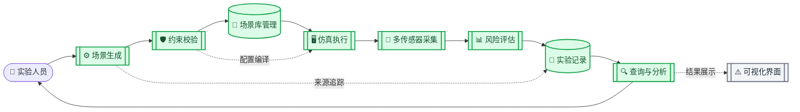
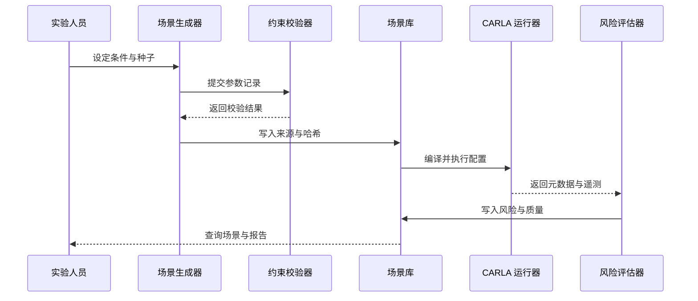

# 软著系统模块映射 V1

_项目：基于生成式 AI 的自动驾驶极端场景库构建与仿真测试平台；版本：V1；更新日期：2026-08-18_

---

> **文档定位：** 本文是软件著作权材料的系统模块映射和工程证据索引，不等同于软著申请提交，也不把规划中的功能写成已完成能力。

## 📋 映射范围

### 软件边界

拟登记软件名称为 **基于 CARLA 的自动驾驶极端场景生成与仿真测试系统 V1.0**。当前映射覆盖从参数级场景生成到场景库管理、CARLA 仿真执行、风险评估和实验结果查询的最小闭环。

系统当前以 Python 命令行和文件接口为主要形态，CARLA 0.9.16 是仿真运行时；代码、配置、Schema、CSV、JSON 和 Markdown 报告共同构成可追溯的软件工程证据。可视化管理界面、强化学习测试代理和完整 OpenSCENARIO 适配不属于当前已完成边界。

### 状态定义

| 状态 | 判定标准 |
| --- | --- |
| **已验证实现** | 有对应源码入口，并有静态、离线或 CARLA 实机证据支持 |
| **原型能力** | 已有代码或实验实现，但覆盖范围、稳定性或产品化条件尚未完成 |
| **待开发** | 当前只有需求边界或设计位置，尚无可作为系统功能的实现证据 |

### 总体架构

下图将软件划分为生成、约束、管理、仿真、评估和实验编排六个已实现或原型模块，并单独标出尚未实现的可视化界面。

## ⚙️ 模块总表

| 编号 | 系统模块 | 当前状态 | 主要代码入口 | 现有证据 |
| --- | --- | --- | --- | --- |
| M01 | 场景生成与条件编译 | 已验证实现 / 原型 | `tools/generate_seed_dataset.py`、`tools/generate_with_model.py`、`models/`、`training/` | LHS、条件 GMM、条件表格 CVAE 已完成离线生成与对照；生成模型仍属于研究分支 |
| M02 | 场景约束与校验 | 已验证实现 | `core/scenario_validator.py`、`schemas/` | Schema、语义校验和 CARLA 配置编译；256 条种子记录全部通过 |
| M03 | 场景库管理 | 已验证实现 | `core/scenario_library.py`、`tools/build_scenario_library.py`、`tools/query_scenario_library.py` | 场景库 V1 收录 117 个独立场景、351 次严格验收证据；查询和质量门回归通过 |
| M04 | 仿真执行与多传感器采集 | 已验证实现 / 原型 | `scenes/scene_04_parameterized.py`、`core/sensor_pipeline.py`、`core/route_follower.py`、`batch_runner.py` | CARLA 0.9.16 实机回归；RGB、Depth、SemSeg、Collision；确定性路线控制已验证 |
| M05 | 风险评估与结果分析 | 已验证实现 | `core/risk_metrics.py`、`analysis/` | `heuristic_v2`、TTC、车距、碰撞和遥测分析；风险反馈 V5 与 27 维代理冻结 |
| M06 | 实验编排与复现管理 | 已验证实现 / 原型 | `batch_runner.py`、`tools/server_*.cmd`、`configs/` | 批次调度、种子、配置哈希、服务器工作流和质量门；服务器模型权重不进入 Git |
| M07 | 可视化管理界面 | 待开发 | 尚无正式入口 | 后续只规划场景筛选、详情、运行证据和风险结果展示 |

## 🔗 详细模块映射

### M01 场景生成与条件编译

- **职责：** 根据目标风险档、天气标签、危险行为和随机种子生成参数级场景记录。
- **输入：** 风险条件、天气/危险标签、生成器参数、随机种子、基础场景配置。
- **处理：** 规则/LHS 设计、条件 GMM 采样、条件表格 CVAE 推理，以及生成记录的统一结构化。
- **输出：** `generated_scenario.schema.json` 约束下的 JSON/JSONL 场景记录、生成器来源和样本种子。
- **实现映射：** `models/conditional_gmm.py`、`models/conditional_tabular_cvae.py`、`training/scenario_dataset.py`、`training/train_conditional_gmm.py`、`training/train_cvae.py`、`tools/generate_seed_dataset.py`、`tools/generate_with_model.py`。
- **证据边界：** 目前可以宣称三种生成器具备可复现的参数生成和离线对照能力；不能宣称 CVAE 已达到稳定的目标风险命中率，也不能把 `target_risk_level` 当作 CARLA 实测风险标签。

### M02 场景约束与校验

- **职责：** 在场景进入场景库或 CARLA 运行前，检查结构合法性、数值范围、条件组合和可编译性。
- **输入：** 生成场景记录、`schemas/generated_scenario.schema.json`、基础 CARLA 配置。
- **处理：** Schema 递归校验、语义约束校验、天气标签推导、参数合并和输出目录重定位。
- **输出：** 校验结果、错误路径信息，以及可直接交给 Scene 04 运行器的 JSON 配置。
- **实现映射：** `core/scenario_validator.py` 的 `validate_scenario_record`、`require_valid_scenario`、`compile_carla_config` 和 `rebase_output_root`。
- **证据边界：** 已验证的是参数级配置合法性和 CARLA 配置编译；它不等价于 CARLA 实机一定成功，实机可执行性由 M04 的运行和严格验收负责。

### M03 场景库管理

- **职责：** 统一保存独立场景的参数、生成来源、内容哈希、运行证据、风险结果和质量分层。
- **输入：** 三生成器对照数据、风险反馈数据、运行明细、聚合统计、Schema 和质量门配置。
- **处理：** 规范化参数向量、SHA-256 场景去重、来源追踪、运行证据聚合、风险汇总、质量分级和多样性计算。
- **输出：** 场景库条目、CSV 索引、质量分析报告和可筛选的查询结果。
- **实现映射：** `schemas/scenario_library_entry.schema.json`、`core/scenario_library.py`、`tools/build_scenario_library.py`、`tools/query_scenario_library.py`、`analysis/analyze_scenario_library.py`。
- **证据边界：** 当前库有 117 个独立场景和 351 次严格验收运行证据；其中部分条目只有聚合级血缘，真实性字段仍为 `not_assessed`，不能写成真实道路分布代表库。

### M04 仿真执行与多传感器采集

- **职责：** 将参数配置加载到 CARLA，控制主车、前车和行人，执行同步仿真并保存逐帧证据。
- **输入：** Scene 04 JSON 配置、CARLA 0.9.16 服务、路线控制配置、传感器配置和 Traffic Manager 种子。
- **处理：** 地图/天气/交通灯设置、Actor 生成、确定性 waypoint 跟踪、危险事件触发、传感器回调和世界状态恢复。
- **输出：** `metadata.json`、`telemetry.csv`、传感器帧、运行状态和严格验收字段。
- **实现映射：** `scenes/scene_01_extreme_weather.py`、`scenes/scene_02_multi_hazard.py`、`scenes/scene_03_multi_sensor.py`、`scenes/scene_04_parameterized.py`、`core/sensor_pipeline.py`、`core/route_follower.py`、`batch_runner.py`。
- **证据边界：** RGB、Depth、SemSeg 和 Collision 已在低频多传感器配置中验证；大批量实验默认使用 RGB + Collision 性能基线，不能宣称所有批次均保存完整三路图像。

### M05 风险评估与结果分析

- **职责：** 从逐帧遥测和事件记录计算可解释风险指标，并对批次结果进行统计分析。
- **输入：** 速度、TTC、前车间距、行人距离、碰撞事件、天气参数、传感器/路线状态和运行元数据。
- **处理：** `heuristic_v2` 风险分解、风险等级映射、碰撞通道计算、重复性统计、代理训练和候选重评分。
- **输出：** 单次风险分数和等级、批次 CSV/Markdown 报告、风险代理诊断和候选列表。
- **实现映射：** `core/risk_metrics.py` 的 `calculate_ttc`、`evaluate_risk_v2`、`evaluate_telemetry_risk`，以及 `analysis/` 下的批次、重复性、生成器、代理和场景库分析脚本。
- **证据边界：** 当前风险指标是仿真遥测上的启发式/代理分析，不是经过真实事故数据标定的安全概率，也不构成跨地图、跨控制策略的泛化结论。

### M06 实验编排与复现管理

- **职责：** 管理批次计划、配置快照、随机种子、服务器任务、结果回收和质量门检查。
- **输入：** 场景配置集合、实验计划、Git 提交、服务器运行参数和 GPU/CARLA 资源状态。
- **处理：** 分批调度、逐次日志、运行状态记录、配置哈希追踪、服务器同步、结果回收和质量门验证。
- **输出：** `batch_summary.csv`、运行明细、配置快照、服务器任务日志、轻量汇总和可追溯的提交哈希。
- **实现映射：** `batch_runner.py`、`tools/server_sync.cmd`、`tools/server_run.cmd`、`tools/server_job_status.cmd`、`tools/server_fetch_results.cmd`、`configs/scenario_library_quality_gate_v1.json`。
- **证据边界：** 笔记本—服务器工作流已实测；服务器模型权重、原始传感器帧和大体积输出不进入 Git，软著材料应引用轻量汇总和代码入口。

### M07 可视化管理界面

- **职责规划：** 提供场景筛选、场景详情、运行证据、风险结果和质量指标的只读展示。
- **计划输入：** M03 输出的场景库索引、M05 输出的风险分析、M06 输出的批次汇总。
- **计划输出：** 场景列表、详情页、风险分布图和运行证据状态。
- **当前状态：** 待开发，不应在软著现阶段功能说明、演示截图或使用说明中写成已完成模块。

## 🔄 最小可运行闭环

当前可作为软件核心演示和后续软著使用说明主线的闭环是“生成 → 校验 → 入库 → 仿真 → 评估 → 查询”。

### 推荐验证入口

| 目的 | 入口 | 验证层级 |
| --- | --- | --- |
| 检查场景库接口 | `tools\test_scenario_library.cmd` | 5 项 `unittest` 回归 |
| 检查场景库构建 | `python tools\build_scenario_library.py --validate-only` | 离线结构/契约校验 |
| 查询库内场景 | `python tools\query_scenario_library.py --quality-tier silver --format table` | 离线查询 |
| 运行单个参数场景 | `python scenes\scene_04_parameterized.py --config <config.json>` | CARLA 实机运行 |
| 运行批次 | `python batch_runner.py --limit <N>` | 批次调度与汇总 |

## 📊 软著材料对应关系

下表用于后续编写软件说明书、功能模块说明和操作截图清单。截图或结果只能来自已完成并可复核的入口，不使用规划功能的占位图冒充系统界面。

| 软著材料章节 | 对应系统模块 | 建议证据 |
| --- | --- | --- |
| 软件概述与总体架构 | M01–M06 | 本文架构图、`PROJECT.md`、仓库目录 |
| 场景生成与参数设置 | M01 | 生成器命令、生成记录、模型选型报告 |
| 场景合法性检查 | M02 | Schema、校验输出、错误路径示例 |
| 场景库建立与检索 | M03 | 场景库条目、CSV 索引、查询命令和质量报告 |
| 仿真场景运行 | M04 | Scene 04 配置、CARLA 运行日志、`metadata.json`、传感器状态 |
| 风险评估与统计分析 | M05 | 风险指标代码、`telemetry.csv`、分析报告和图表 |
| 批量实验与复现 | M06 | 批次计划、配置哈希、汇总 CSV、服务器任务日志 |
| 可视化界面 | M07 | 暂不纳入已完成功能；待界面实现后补充 |

## ⚠️ 当前不可宣称内容

- 软著申请或登记已经完成；当前只完成系统模块映射前置工作。
- 已实现完整的 Web/桌面可视化管理界面；目前主要入口仍是命令行和文件接口。
- 已实现强化学习测试代理或自动对抗性测试闭环；阶段四尚未完成。
- 已实现完整 OpenSCENARIO 导入、导出和跨仿真器兼容；当前核心配置是项目自定义 JSON 与 CARLA 运行器。
- 生成样本已经等价于真实道路样本；场景库真实性目前保持 `not_assessed`。
- CVAE 已稳定控制实测风险等级；现有证据支持其作为研究分支，不支持替代 LHS 工程基线。

## 🎯 后续落地顺序

1. 固化 M01–M06 的模块接口、输入输出和异常处理说明。
2. 选定软著说明书需要展示的最小操作闭环，优先使用命令行可复核证据。
3. 开发 M07 的只读可视化原型，先覆盖场景筛选、详情和风险结果，不引入新的仿真逻辑。
4. 完成阶段四的 OpenSCENARIO/CARLA 适配和测试代理后，再扩充系统模块映射。
5. 最终冻结软件版本、补齐使用说明和截图，再进入软著材料整理与登记准备。

---

_本文只维护当前有效的模块边界和证据状态；新增功能必须先通过对应验证，再提升模块状态。_
