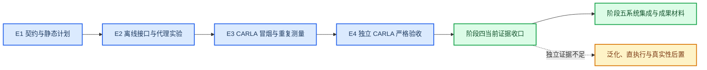

# 阶段四质量门与实验结论收口 V1

_完成日期：2026 年 8 月 23 日；收口范围：仿真平台与对抗性测试代理当前工程基线_

## 收口判定

阶段四按“硬运行质量门和当前证据收口完成”关闭，项目可以转入阶段五系统集成与成果产出。该判定证明现有场景生成、闭环编排、Gymnasium 接口、冻结策略执行和 CARLA 严格验收链路可复现，不等价于“强化学习策略完成”“OpenSCENARIO 已可直接执行”或“平台最终封版”。

本轮不新增 CARLA 运行，不重复已有 pair，不启动 CARLA 在线训练。所有结论均来自已经冻结的文档、轻量汇总和运行元数据。

## 证据等级

| 等级 | 定义 | 可支持的结论 | 不可外推的结论 |
|---|---|---|---|
| E4 | 独立场景、冻结配置、真实 CARLA 严格验收 | 当前样本集合上的运行质量和成对描述 | 跨地图、跨控制器或总体策略优势 |
| E3 | 真实 CARLA 冒烟或同一场景的重复 Traffic Manager 测量 | 运行链路可用、场景内重复行为 | 新的独立样本量或策略泛化 |
| E2 | 冻结代理、离线候选、mock/check_env 或静态批量验证 | 接口、约束和训练工程链路可用 | CARLA 风险收益、碰撞概率或策略效果 |
| E1 | 设计文档、Schema、配置和未执行计划 | 契约与预期行为已定义 | 任何运行时结论 |

## 质量门矩阵

### 硬运行质量门

| 质量门 | 证据 | 等级 | 判定 |
|---|---|---|---|
| 独立策略运行严格验收 | 18 个独立 pair、`54/54` 条运行通过 | E4 | 通过 |
| CARLA 版本一致 | `54/54` 客户端/服务端均为 `0.9.16` | E4 | 通过 |
| 风险方法一致 | `54/54` 使用 `heuristic_v2` | E4 | 通过 |
| RGB 传感器完整 | `54/54` 每次写盘 `100` 帧 | E4 | 通过 |
| 服务健康 | `54/54` 运行后健康检查通过 | E4 | 通过 |
| 路线验收 | `54/54` 通过；`53/54` 为全程路线，`1/54` 为碰撞前路线验收 | E4 | 通过，保留边界 |
| 原始重点 pair 重复测量 | 3 个源场景、3 个交通种子、`27/27` 条运行通过 | E3 | 通过，不增加独立样本量 |
| 扩展重点分层重复测量 | 2 个源场景、3 个交通种子、`18/18` 条运行通过 | E3 | 通过，不增加独立样本量 |
| LHS/high 独立边界校准 | V1/V2 合计 9 个独立候选均通过严格验收 | E4 | 通过 |

唯一的非全程路线记录是扩展 `CVAE/critical` 的 SAC 碰撞运行。碰撞前双车在途率为 `1.0`，最大路线偏差为 `0.992 m`；碰撞后偏离不作为碰撞前路线控制器失败，也不能写成全程路线通过。

### 工程接口质量门

| 能力 | 当前证据 | 等级 | 判定 |
|---|---|---|---|
| 对抗性代理契约 | 15 维动作、34 维观测、奖励和终止语义已冻结并回归 | E2 | 通过 |
| 单步/多步闭环 | CARLA 单步 `2/2`、多步 `4/4` 严格冒烟 | E3 | 通过 |
| 异常路径编排 | 运行失败中止、无效候选恢复、重复截断测试 | E2 | 通过 |
| Gymnasium/SB3 接口 | 两套 `check_env`、模型保存/加载/预测通过 | E2 | 通过，仅限工程链路 |
| Gymnasium 真实执行器 | CARLA 环境级 `3/3` 冒烟通过 | E3 | 通过 |
| 分层采样与非学习基线 | 12 个分层可复现，有限重试后四策略均为 `24/24` 有效候选 | E2 | 通过 |
| 四策略 CARLA 对照 | 12 个共享基线加 48 个候选，`60/60` 严格验收 | E4 | 通过 |
| 冻结代理训练执行器 | 模型哈希和 27 维特征顺序校验，多种子代理基准完成 | E2 | 通过，仅限代理环境 |
| OpenSCENARIO 最小交换 | 256 条静态转换和一次生成 CARLA JSON 冒烟 | E2/E3 | 有限通过 |
| OpenSCENARIO 直执行 | `.xosc` 尚未由 ScenarioRunner 直接执行 | E1 | 未完成，后置 |

### 研究结论质量门

| 研究问题 | 当前结果 | 判定 |
|---|---|---|
| 冻结策略是否可稳定进入真实执行链路 | 独立策略 `54/54` 严格通过，未出现服务、传感器或路线系统性回归 | 通过 |
| SAC 是否优于 rule-guided LHS | 代理基准中 SAC 平均增量 `+0.808`，rule-guided LHS 为 `+0.910`；CARLA 独立集合上两者均为 `10/18` 风险升高 | 未证明 |
| 任一候选策略是否具有普遍风险增益 | SAC 独立集合均值/中位增量 `+1.534/+0.246`；rule-guided LHS 为 `+0.193/+1.128`，批次间方向和幅度不稳定 | 未证明 |
| LHS/high 是否值得作为风险回归观察对象 | 一个重复源场景上 SAC 和 rule-guided LHS 均 `3/3` 引入碰撞，新增 9 条独立边界校准样本 | 支持优先观察，不支持泛化 |
| 27 维风险代理是否可替代实测风险 | 9 条独立校准 MAE `11.752`、Spearman `0.433`，high 召回 `5/6`，碰撞召回 `2/4` | 不通过升级门 |
| CARLA 在线 RL 训练是否具备启动依据 | 策略普遍优势和代理可靠性均未证明，运行成本显著高于代理训练 | 不启动 |
| 场景库是否具备真实性结论 | 117 个条目的真实性均为 `not_assessed` | 未评估 |

## 统计口径

1. 独立策略主结论的实验单位是源场景 pair，共 `18` 个；每个 pair 的共享基线、SAC 和 rule-guided LHS 构成三条成对运行。
2. Traffic Manager 种子是同一场景的重复测量。`27/27` 和 `18/18` 用于检查场景内方向与执行波动，不可并入独立样本数。
3. LHS/high 校准的 9 条是独立候选，可用于边界误差和召回描述；样本量仍不足以拟合或宣称概率校准模型。
4. 四策略 `60/60` 对照与后续策略独立 `54/54` 使用不同目的和集合，不能直接相加为一个统一策略样本量。
5. `target_risk_level` 是生成或筛选条件，实验标签以 CARLA `observed_risk`、碰撞事件和严格验收元数据为准。
6. high/critical 场景中的碰撞是压力测试结果，不自动构成基础设施质量门失败；版本、传感器、服务健康和碰撞前路线证据必须单独审核。

## 实验结论

1. 阶段四的核心工程结论成立：冻结候选能够经过约束、闭环编排、Gymnasium 外壳和真实 CARLA 执行器完成严格验收，当前没有基础设施级质量回归。
2. rule-guided LHS 仍是必要的非学习基线。它在首轮四策略 12 pair 对照中有 `10/12` 风险升高、`8/12` 为四策略最高，但在后续 18 个独立 pair 上仅有 `10/18` 风险升高，不能写成普遍最优。
3. SAC 已证明训练与冻结部署链路可用，但未证明策略优势。其 18 个独立 pair 平均风险增量为正，批次间由 `-2.017` 变为 `+8.636`，对场景集合敏感，不能据此增加训练预算。
4. LHS/high 重复测量揭示了稳定的单场景碰撞边界，但 9 条独立校准同时暴露代理排序与碰撞召回不足。因此该分层适合保留为回归样例，风险代理只保留候选筛选用途。
5. mock 训练、`check_env`、冻结代理基准和静态 OpenSCENARIO 转换均是工程证据，不得转写成真实策略效果、在线训练完成或通用标准兼容。

## 停止规则与重启条件

阶段四实验在当前证据集停止扩张：不重复已有 pair，不启动 CARLA 在线训练，不因单个高风险碰撞继续无边界补样。CARLA 保持停止状态，需要新证据时再显式启动。

仅在以下任一条件成立时重新开启阶段四实验：

1. 系统集成或成果复核发现明确的运行回归，需要最小独立场景复现；
2. 出现当前 18 个策略 pair 和 9 个 LHS/high 校准样本未覆盖的独立支持域，并预先定义覆盖目标；
3. ScenarioRunner 直执行成为软著或论文的硬交付项，需要单独完成 `.xosc` 运行适配和实机验收；
4. 更大独立集合预先定义后，SAC 的实测风险增益、碰撞行为和路线质量门持续优于冻结规则基线，才评估增加训练预算；
5. 风险代理在独立校准集上达到单独设定的误差、排序和碰撞召回门槛后，才讨论作为训练信号，且仍不能替代最终 CARLA 验收。

## 阶段五交接

阶段五优先整合“生成、校验、场景库、仿真、风险分析、实验编排、只读 Dashboard”的冻结入口，并从本报告引用可证明结论。成果材料必须保留以下限定：OpenSCENARIO 仅完成最小交换适配，RL 仅完成工程链路和有限独立评估，场景真实性未评估，当前成果是可复现研究原型而非最终产品。

主要证据索引：

- `docs/adversarial_policy_carla_quality_gate_v1.md`
- `docs/adversarial_policy_carla_independent_aggregate_v1.md`
- `docs/adversarial_policy_carla_repeat_evaluation_v1.md`
- `docs/adversarial_policy_carla_repeat_expand_v1.md`
- `docs/adversarial_gymnasium_evaluation_v1.md`
- `docs/adversarial_proxy_benchmark_v1.md`
- `docs/lhs_high_proxy_calibration_v2.md`
- `docs/openscenario_carla_adapter_v1.md`
