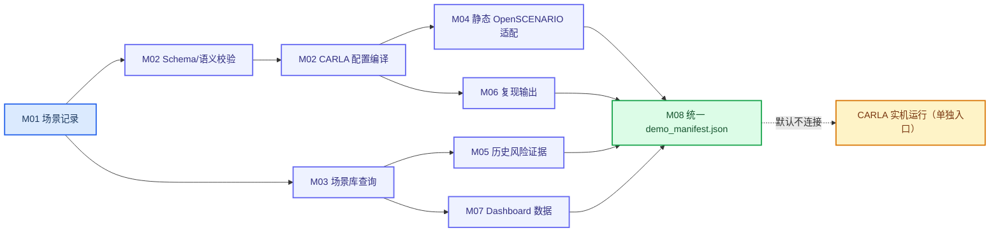

# 阶段五一键最小演示链路与接口清单 V1

_版本：V1；默认模式：离线静态与历史证据读取；不连接 CARLA_

## 定位

阶段五先冻结一条可复现、可审计、不会误启动仿真的最小演示链路。入口为 `tools/stage5_demo.cmd`，核心编排器为 `tools/stage5_minimal_demo.py`。它串联 M01–M08 的最小可用接口：加载场景记录、校验与配置编译、场景库查询、OpenSCENARIO 最小适配、历史风险证据读取、复现清单和 Dashboard 数据校验。

默认演示是离线模式，输出 `carla_connected=false`。它证明接口可以组合和产出可追溯文件，不证明新的 CARLA 运行、策略效果或在线训练。



## 一键运行

在项目根目录执行：

```powershell
tools\stage5_demo.cmd
```

指定输入或输出目录：

```powershell
tools\stage5_demo.cmd --record data\scenarios\seed_v1\example_record.json --output-dir F:\Carla\project-transfer\stage5-demo-v1
```

核心 Python 入口也可以直接调用：

```powershell
D:\ANACONDA\envs\Carla666-0916\python.exe tools\stage5_minimal_demo.py
```

默认输出目录是 `artifacts/stage5_minimal_demo_v1/`，该目录被 Git 忽略。主要输出如下：

| 输出 | 内容 | 证据边界 |
|---|---|---|
| `input_record.json` | M01 输入记录副本 | 记录来源可追溯，不代表新生成 |
| `compiled_carla_config.json` | M02 编译后的完整 CARLA 配置 | 静态配置可用，不代表服务在线 |
| `<sample_id>.xosc` | OpenSCENARIO 1.0 最小交换子集 | XML 可解析；ScenarioRunner 直执行与完整 Scene 04 验收需引用独立 manifest |
| `<sample_id>.carla.json` | 适配器生成的 CARLA 配置 | 可做 `--validate-only`，不代表实机结果 |
| `<sample_id>.adapter_manifest.json` | 转换血缘、映射和状态 | 记录适配边界 |
| `demo_manifest.json` | M01–M08 状态、路径、限制和 `carla_connected` | 阶段五主审计入口 |

## M01–M08 接口清单

| 模块 | 主入口 | 输入 | 输出 | 默认模式 | 当前证据等级 |
|---|---|---|---|---|---|
| M01 场景生成 | `tools/generate_seed_dataset.py`、`tools/generate_with_model.py`、`tools/run_diffusion_comparison.py` | 风险条件、种子、模型工件 | `generated_scenario` JSON/JSONL、对照评估 | 离线 | E2 |
| M02 校验编译 | `core.scenario_validator.require_valid_scenario`、`compile_carla_config` | 场景记录、Schema、基础配置 | 校验结果、完整 CARLA 配置 | 离线 | E2 |
| M03 场景库 | `core.scenario_library`、`core.scenario_query`、`tools/query_scenario_library.py`、`GET /api/scenarios/search` | `entries.jsonl`、结构化筛选条件、白名单关键词 | 场景行、风险/质量/证据摘要、查询元数据 | 只读 | E2/E4（历史） |
| M04 仿真采集 | `scenes/scene_04_parameterized.py`、`batch_runner.py` | CARLA JSON、CARLA 服务 | `metadata.json`、`telemetry.csv`、传感器证据 | 单独实机入口 | E4（历史） |
| M04 交换适配 | `tools/convert_scenario_to_openscenario.py` | 场景记录、映射、基础配置 | `.xosc`、`.carla.json`、适配清单 | 静态 | E2/E3 |
| M05 风险评估 | `core.risk_metrics.evaluate_telemetry_risk`、`evaluate_risk_v2` | 遥测、事件、参数、风险配置 | `observed_risk` 分数/等级/分量 | 运行后离线 | E4（历史） |
| M06 实验复现/任务编排 | `core.web_task_orchestrator`、`tools/server_sync.cmd`、`tools/server_run.cmd`、`tools/server_fetch_results.cmd` | 提交、配置、任务和资源 | 任务状态/结果、任务元数据、轻量汇总 | 本机 CPU / 服务器外部 | E2/E4（历史） |
| M07 Dashboard/任务页 | `tools/web_app.py`、`tools/scenario_dashboard.py`、`tools/web_app.cmd` | 场景库索引、条目和任务状态 | 页面、JSON 查询接口、任务结果 | 本地 Web | E2 |
| M08 最小编排 | `tools/stage5_minimal_demo.py`、`tools/stage5_demo.cmd` | M01 记录、M03 库、M02 基础配置 | `demo_manifest.json` 和演示产物 | 离线默认 | E2 |

### M03 受控查询契约

M03 的 CLI 与 Web API 共用 `core.scenario_query.QuerySpec`。支持生成器、`target_risk`、`observed_risk`、碰撞、天气/危险标签、证据粒度、质量层级、CARLA 版本、风险分数/多样性范围、排序和数量限制。`keyword` 只在白名单字段中做大小写不敏感包含匹配，多个关键词按 AND 组合；风险枚举、布尔值、排序和数值边界非法时返回 CLI 参数错误或 HTTP `400`。

示例：

```text
GET /api/scenarios/search?target_risk=high&weather_tag=night&keyword=lhs&sort=risk_desc&limit=3
```

该接口只读现有 `entries.jsonl`，不修改索引、不生成新的风险证据、不连接 CARLA，也不把自然语言句子解释为查询条件。

### M06/M07 Web 任务契约

`POST /api/tasks` 接受四类任务：`generation`、`validation`、`risk_analysis` 和 `carla`。前三类在本机 CPU worker 中执行并将状态写入 `F:\Carla\output-0.9.16\web_tasks`（可由 `--task-dir` 覆盖）；后者默认状态为 `awaiting_confirmation`。调用 `POST /api/tasks/{task_id}/confirm` 后只生成 `confirmed_manual` 登记结果，不启动 CARLA，结果明确包含 `carla_connected=false`、`execution_started=false`。任务状态和结果可通过 `/api/tasks`、`/api/tasks/{task_id}`、`/api/tasks/{task_id}/result` 查询。

## 关键代码契约

### 场景记录

- Schema：`schemas/generated_scenario.schema.json`。
- 必须区分 `conditions.target_risk_level` 与 `observed_risk`。
- M02 失败时不得进入配置编译、适配或实机运行。

### 场景库条目

- Schema：`schemas/scenario_library_entry.schema.json`。
- 当前快照：`117` 个独立场景、`351` 次来源批次严格验收证据。
- `verification_basis` 区分 `direct_run_evidence` 与 `inherited_batch_acceptance`。
- `realism` 保持 `not_assessed`，查询结果不得解释为真实道路分布。

### CARLA 运行证据

M04 实机运行必须同时检查运行状态、传感器写盘、CARLA 服务健康、路线验收和 `metadata.json`。M08 默认不执行 M04 实机入口，因此其清单中明确写入 `carla_connected=false` 和 `new_carla_risk_evaluation=false`。

### 适配器

`custom_json_to_openscenario_carla_v1` 每次静态转换输出 `.xosc`、`.carla.json` 和 `.adapter_manifest.json`。天气、传感器、Traffic Manager、风险算法和路线控制器仍以 CARLA 配置旁路保存；默认 M08 不启动 ScenarioRunner，已验证的单场景直执行和关联完整验收见 `docs/scenario_runner_full_acceptance_v1.md`。

## 分层运行入口

| 场景 | 推荐入口 | 是否启动 CARLA | 适用目的 |
|---|---|---:|---|
| 阶段五展示、接口联调 | `tools/stage5_demo.cmd` | 否 | 快速展示全链路和产物 |
| 单场景静态配置检查 | `scenes/scene_04_parameterized.py --validate-only` | 否 | 检查 CARLA 配置形状 |
| Dashboard 页面 | `tools/scenario_dashboard.cmd` | 否 | 浏览场景库和历史证据 |
| 单场景实机回归 | `scenes/scene_04_parameterized.py --config <path>` | 是 | 产生新的 CARLA 运行证据 |
| 服务器批次实验 | `tools/server_run.cmd` + 专用任务入口 | 是/按任务 | 正式实验，需资源和版本检查 |
| Web 离线任务 | `tools/web_app.cmd` 的 `/tasks` 页面或 `/api/tasks` | 否 | 生成、校验、历史风险分析；CPU worker |
| Web CARLA 任务登记 | `/api/tasks` + `/confirm` | 否（登记） | 显式确认后转交服务器或专用 CARLA 入口 |

任何实机入口都不由 M08 隐式调用。需要真实 CARLA 证据时，必须单独建立任务、记录提交哈希、配置、种子、CARLA 版本和严格验收结果。

## 验收条件

M08 离线演示通过条件：

1. 输入记录 Schema 和语义校验通过；
2. 编译配置包含 Scene 04 所需顶层字段；
3. Scene 04 `--validate-only` 返回成功；
4. OpenSCENARIO XML 可解析，适配清单存在；
5. 场景库查询与 Dashboard 行数一致；
6. `demo_manifest.json` 明确记录 `carla_connected=false`、历史风险证据来源和未完成边界。

这组条件是阶段五接口集成门，不升级阶段四的 CARLA 实机结论。
