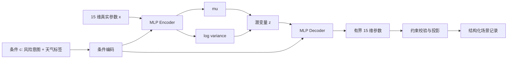

# 生成式 AI 模型选型与适配调研报告

> 调研日期：2026-08-12
>
> 调研范围：只讨论本项目中“条件输入到结构化场景参数”的生成式 AI 选型、训练与适配。CARLA、风险评估和场景校验仅作为模型的输入输出约束，不展开为独立系统方案。
>
> 文献范围：已整理的 56 篇论文。对 46 篇本地 PDF 全部完成正文提取，其中 17 篇核心论文重点核对方法、数据、算力、实验与局限，其余 29 篇完成摘要、方法定位和结论级筛读；10 篇未下载论文读取 arXiv 官方题名、版本日期与摘要。核心结论以全文证据为主，摘要证据只用于路线补充与排除。

## 1. 最终决策

本项目当前应采用：

**约束感知的轻量条件表格 VAE（Constraint-aware Conditional Tabular VAE，简称 C-TabCVAE）作为第一版可行参数分布模型，以现有 Latin Hypercube/规则生成器和条件 GMM 作为对照；取得足够 CARLA 实测风险标签后，升级为“CVAE 可行分布先验 + 风险代理/反馈优化 + 潜空间条件流”的双阶段生成器。**

因此，项目的完整生成式 AI 主线不是“只训练一个 CVAE”，而是：

```text
可行参数生成先验 -> 约束过滤 -> 风险反馈引导 -> 多样化高风险候选
```

具体边界如下：

1. **现在实现的主模型**：单个小型 MLP-CVAE，生成 15 维连续场景参数，不生成代码、视频、传感器图像或完整多车轨迹。
2. **现在不能宣称的能力**：模型尚未学会“真实高风险分布”。当前 `target_risk_level` 是人工参数设计条件，不是 CARLA 实测标签。
3. **实测标签形成后的主研究点**：训练风险代理，对 CVAE 候选进行风险引导、排序或潜变量优化；此时才能研究“给定期望风险，生成经实测验证的危险场景”。
4. **中期升级模型**：在累计足够多成功仿真样本后，引入轻量条件 Flow Matching，在 CVAE 潜空间中学习从普通/中风险到高风险分布的迁移。
5. **LLM 的角色**：只作为可选的自然语言条件解析器、行为意图规划器或检索器，不直接生成最终 15 维连续参数，更不直接生成可执行 CARLA 代码。
6. **暂不采用**：GAN、完整轨迹扩散模型、视频世界模型和端到端 LLM 数值生成。

这不是“CVAE 永远优于扩散或 Flow”，而是当前任务维度、数据来源、标签质量和本机算力共同决定的阶段性最优解。

## 2. 本项目中的生成任务定义

### 2.1 模型真正需要完成的任务

模型输入为条件 `c`，输出场景参数向量 `x`：

```text
c = 目标风险意图 + 可选天气条件
x = 天气参数 + 前车急刹参数 + 行人横穿参数
```

当前场景族固定为“极端天气 + 前车急刹 + 行人横穿”。因此这不是通用道路生成、地图生成、多车轨迹生成或视频生成任务，而是一个**小维度、有明确边界和强语义约束的条件表格生成问题**。

### 2.2 建议由模型学习的 15 个连续变量

| 分组 | 模型输出字段 | 数量 |
|---|---|---:|
| 天气 | `cloudiness`、`precipitation`、`precipitation_deposits`、`wind_intensity`、`fog_density`、`fog_distance`、`sun_altitude_angle`、`wetness` | 8 |
| 前车 | `initial_distance_m`、`brake_trigger_seconds`、`brake_intensity` | 3 |
| 行人 | `forward_distance_m`、`roadside_offset_m`、`trigger_seconds`、`speed_mps` | 4 |
| 合计 | 连续生成参数 | **15** |

以下字段不应交给模型学习：

| 字段 | 处理方式 | 原因 |
|---|---|---|
| `duration_seconds` | 固定或由外层配置指定 | 当前数据中恒为 20 秒 |
| `traffic_manager_seed` | 运行时生成 | 随机种子不是场景语义 |
| `spawn_z_offset_m` | 固定为当前可靠值 | 当前数据中恒为 0.5 |
| `weather_tags` | 根据生成的天气参数推导 | 避免标签与数值矛盾 |
| `hazard_tags` | 当前场景族固定 | 不是连续生成目标 |
| `condition_text_zh` | 模板或语言层生成 | 不应反向干扰数值模型 |
| `observed_risk` | 仿真后回填 | 这是结果标签，不是生成输出 |
| `provenance`、`sample_id` | 外层记录器生成 | 属于元数据 |

把 15 个有效变量与其余派生字段分离，是当前小数据条件下最重要的模型简化。

### 2.3 条件输入设计

第一版建议使用：

```text
c = one_hot(target_risk_level, 4) + multi_hot(requested_weather_tags)
```

- `target_risk_level` 在第一版只代表**参数设计意图**。
- `requested_weather_tags` 应是用户希望满足的天气条件，而输出记录中的最终 `weather_tags` 仍由参数推导。
- 当前 `hazard_tags` 固定，不需要送入模型。
- 如果没有自然语言入口，`condition_text_zh` 不应进入训练。
- 获得实测数据后，应增加连续目标风险 `desired_risk_score`，并优先使用 `observed_risk` 监督，而不是继续把人工目标标签当成真实标签。

## 3. 文献证据怎样改变选型

### 3.1 综述给出的共同评价标准

安全关键场景生成综述 [S1] 将方法概括为数据驱动、对抗生成和知识驱动，并指出真实性、效率、多样性、迁移性和可控性是主要挑战。另一篇场景生成综述 [S2] 强调功能场景、逻辑场景和具体场景之间的层级，以及采样、搜索和数据驱动生成的区别。

对本项目而言，优先级应调整为：

1. 结构与语义有效性；
2. 条件可控性；
3. 小数据和本机可训练性；
4. 参数覆盖与多样性；
5. 经实测确认的危险性；
6. 与真实交通分布的相似性。

原因是本项目当前生成的是特定 CARLA 场景族的参数，而不是从真实交通日志重建完整交通分布。

### 3.2 大型轨迹生成论文不能直接移植

| 论文 | 生成对象与数据前提 | 对本项目的启示 | 不能直接照搬的原因 |
|---|---|---|---|
| TrafficGen [S3] | Waymo 约 5 万训练场景，生成车辆布局和长轨迹 | 自回归生成能学习多变量相关性；分布和多样性需联合评价 | 本项目只有 180 条训练记录，且输出只是 15 维参数 |
| CTG [S4] | 在 nuScenes 轨迹上训练条件扩散，通过可微规则指导轨迹 | “生成先验 + 测试时指导”比单纯输出后优化更稳 | 当前没有多步轨迹数据，也没有必要承担扩散采样成本 |
| RealGen [S5] | nuScenes 场景检索、模板扩充和轨迹生成 | 检索可保留真实模板，适合未来引入真实事故/轨迹数据 | 当前没有可检索的大规模真实场景库 |
| DiffScene [S6] | 在多车轨迹扩散模型上加入安全引导 | 危险性不应只靠训练标签，可通过引导目标注入 | 任务维度和数据规模明显大于本项目 |
| SaFeR [S7] | WOMD/nuPlan，约 30 万交互配置 | 危险性必须与可行域、交互真实性共同约束 | 当前数据没有复杂多车交互和真实轨迹先验 |
| LD-Scene [S8] | nuScenes；扩散训练 200 轮、4 张 RTX 4090，另使用 GPT-4o 生成/调试指导函数 | LLM 更适合表达目标，扩散模型负责连续轨迹 | 算力、数据和模型复杂度均不适合当前第一版 |

这些论文证明扩散模型在**轨迹生成、复杂交互和测试时指导**上有优势，但不能证明它是 15 维小样本参数生成的最佳起点。

### 3.3 2026 年 Flow 系列的真正启示

| 论文 | 关键前提 | 可迁移思想 | 当前结论 |
|---|---|---|---|
| Conditional Flow-VAE [S9] | 约 1 万真实普通场景、1 万模拟危险场景、约 500 个真实安全关键片段 | 先用 VAE 学可行场景潜空间，再用 Flow 把普通分布迁移到危险分布；真实与模拟数据混合优于单一来源 | **最适合作为本项目中期架构参考，不适合作为当前直接复现目标** |
| RiskFlow [S10] | nuScenes、场景 Transformer、地图编码器；单张 RTX 4090 训练 10 万步，测试时做 30 步风险/地图引导 | Flow 可减少扩散推理步数；输出空间指导同时兼顾危险性和道路可行性 | 可借鉴为“轻量潜空间 Flow + 约束引导”，不应复刻完整轨迹模型 |
| CCFM [S11] | nuScenes/nuPlan；2 张 H200 训练，L40S 执行实验 | 把碰撞或严重度写成可微约束，并投影回可行流形 | 证明约束很重要，但当前硬件和数据不支持完整复现 |

这组最新工作没有否定 CVAE，反而反复采用“**先学可行分布或潜空间，再进行风险迁移/指导**”的两阶段思想。因此本项目最合理的演进路线不是从 CVAE 和 Flow 中二选一，而是先 CVAE、后潜空间 Flow。

### 3.4 LLM 论文说明 LLM 应放在哪里

| 论文 | LLM 的实际作用 | 对本项目的结论 |
|---|---|---|
| ChatScene [S12] | 将文本拆成行为、道路几何、相对位置，再检索和拼接人工校验过的 Scenic 代码片段；论文明确讨论直接生成代码的不可编译/API 幻觉问题 | 使用 LLM 做结构化条件解析和检索，不让它直接生成最终参数或代码 |
| LLM-attacker [S13] | 多个 LLM 模块识别最有威胁的车辆并迭代修改识别函数，轨迹仍由预测模型和闭环框架产生 | LLM 擅长高层交互推理，不是低层连续分布建模器 |
| Seeking to Collide [S14] | 在 81 个 Waymo 场景上用 DeepSeek API 识别危险行为并生成/修改轨迹代码 | 可用于未来扩展行为类型；论文自身将迁移到 CARLA列为后续方向 |
| CRITICAL [A8] | LLM 是闭环分析的可选组件，关键仍是风险反馈驱动的数据生成 | LLM 不是完成风险闭环的必要条件 |

因此，本项目若加入 LLM，正确接口是：

```text
自然语言 -> 严格条件对象 -> C-TabCVAE -> 连续参数
```

而不是：

```text
自然语言 -> LLM 随意输出完整 JSON/代码
```

### 3.5 低维参数论文支持“分布先验 + 风险优化”

Learning to Collide [S17] 与当前任务形式高度接近：论文将位置、朝向、触发距离等场景构件表示成条件概率分布，用小型线性网络生成参数，再把仿真系统返回的距离、碰撞奖励和不合理位置惩罚用于策略梯度优化。它说明低维安全关键场景不一定需要扩散模型，**参数依赖结构、风险反馈和合理性惩罚比网络规模更关键**。

OSG [S18] 则把逻辑场景定义成参数区间，用真实轨迹数据训练 Masked Autoregressive Flow 估计场景自然性，再以风险强度调节器和分群粒子群搜索寻找不同风险等级、多个局部最优的参数组合。它对本项目的直接启示是：

1. 生成模型负责提供可行性或自然性先验；
2. 风险目标负责引导，而不是假设高风险样本会自动从先验中出现；
3. 搜索必须保留多样性，不能只收敛到一个碰撞参数点；
4. MAF 的显式似然适合未来拥有真实数据后的自然性评分，但当前 180 条训练设计样本不足以支撑复杂密度流作为首版核心。

这两篇论文强化了本报告的最终架构：第一版用小型 CVAE 学参数联合分布，随后用实测风险代理、潜变量优化或反馈搜索把采样推向目标风险，同时保留约束和多样性。

### 3.6 参数采样与反馈搜索仍是必要对照

Scenic [S15] 说明概率程序可以从带约束的参数范围中采样具体场景；ISS-Scenario [S16] 展示了参数范围、采样、生成、仿真、评价和迭代的闭环，并发现遗传搜索比随机采样能找到更多碰撞案例。

这意味着本项目的生成式 AI 必须至少超过两个简单对照：

1. 现有分层 Latin Hypercube/规则采样；
2. 使用实测反馈的遗传搜索或黑盒优化。

若神经生成器在有效率、多样性或高风险命中率上不能超过这些基线，就不能仅凭“使用了深度学习”认定选型成功。

## 4. 候选模型评分

评分为本项目当前条件下的工程决策分，不是论文通用排名。总分按任务匹配 25%、数据适配 20%、可控与约束 20%、算力 15%、可解释与实现 10%、升级空间 10% 加权。

| 路线 | 当前总分 | 结论 |
|---|---:|---|
| **轻量条件表格 CVAE** | **90/100** | 当前主选型 |
| Latin Hypercube/规则采样 | 89/100 | 必须保留的非 AI 对照 |
| 条件 GMM/KDE | 83/100 | 必须保留的统计生成对照 |
| MAF/其他显式密度流 | 76/100 | 有真实数据后可作自然性先验；当前样本过少 |
| 轻量条件 Flow Matching | 78/100 | 数据成熟后的首选升级 |
| 条件扩散 | 69/100 | 仅在扩展到轨迹生成后考虑 |
| LLM 直接结构化生成 | 62/100 | 只做条件解析器，不做核心生成器 |
| GAN/cGAN | 55/100 | 不推荐 |
| 视频世界模型 | 24/100 | 与当前输出任务不匹配 |

### 4.1 为什么 CVAE 当前得分最高

- 输出维度低，MLP 足够，不需要地图编码器、时序 Transformer 或 U-Net。
- 单次前向即可采样，适合在本机生成大量候选。
- 潜空间便于插值、风险方向优化和后续接入 Flow Matching。
- 条件输入明确，可同时控制风险意图和天气类别。
- 相比 GAN，训练更稳定，模式崩溃风险更低。
- 相比扩散和 Flow，当前小数据下参数量和训练难度更可控。
- 相比 LLM，连续变量的联合分布、边界和重复实验更容易管理。

### 4.2 CVAE 的局限

- 180 条训练样本仍非常少，容易过拟合或发生后验坍塌。
- 当前数据来自人工设定区间，CVAE 学到的主要是已有采样规则，而不是现实交通规律。
- 标准正态先验可能产生落在训练分布稀疏区域的组合。
- 如果只按 `target_risk_level` 训练，模型只能复现“设计风险意图”，不能证明生成结果达到了对应实测风险。

因此第一版 CVAE 的定位必须是**生成接口和可行分布基线**，而不是最终科研结论。

## 5. 推荐的 C-TabCVAE 设计

### 5.1 总体结构



### 5.2 第一版网络建议

| 项目 | 建议起点 |
|---|---|
| 输入参数维度 | 15 |
| 条件维度 | 4 维风险 one-hot + 天气 multi-hot |
| 编码器 | `input -> 64 -> 32 -> mu/logvar` |
| 潜变量维度 | 4、6、8 做消融，优先从 6 开始 |
| 解码器 | `z + condition -> 32 -> 64 -> 15` |
| 激活 | ReLU/SiLU；最终层 Sigmoid |
| 输出缩放 | 从 `[0,1]` 映射到每个字段的允许范围 |
| 批大小 | 16 或 32 |
| 优化器 | Adam，早停，至少 5 个随机种子重复 |
| 参数规模 | 保持小型，不引入 Transformer |

这里的数值是建议起点，必须通过验证集和重复实验选择，不应直接写成已验证的最优超参数。

### 5.3 数据预处理

1. 每个连续字段按模型允许范围缩放到 `[0,1]`。
2. `fog_distance` 等方向与危险程度相反的变量无需手工反转，模型可学习相关性；分析时单独解释即可。
3. 对接近边界且分布明显偏斜的字段，可比较 min-max 与 logit 变换，但第一版优先保持简单。
4. 数据划分不能只依赖当前随机拆分。建议增加按参数区域或生成种子分组的外推测试，防止测试集只是同一人工分布的插值样本。
5. 训练时只读取模型字段、条件字段和数据来源；不得把 `observed_risk=null` 当成数值零。

### 5.4 损失函数

第一版使用：

```text
L = L_reconstruction + beta * L_KL
```

- `L_reconstruction`：对归一化后的 15 个字段使用加权 Smooth L1 或 MSE。
- `L_KL`：标准 CVAE 的 KL 散度。
- `beta`：使用 KL warm-up，避免小数据下模型忽略潜变量；比较多个较小权重。

可选消融项：

```text
L = L_reconstruction + beta * L_KL
  + lambda_cond * L_condition_consistency
  + lambda_sem * L_soft_constraint
```

- `L_condition_consistency` 只衡量人工条件一致性，不能当成实测危险性。
- `L_soft_constraint` 可对时间关系等可微约束施加惩罚，但第一版仍必须保留独立硬校验。

### 5.5 约束适配

模型输出后执行两层处理：

1. **边界层**：Sigmoid 与字段范围保证数值不越过 Schema 上下限。
2. **语义层**：拒绝或投影违反时间关系的样本，例如前车急刹必须在结束前保留时间、行人必须能在场景时长内完成横穿。

天气标签应在参数生成后重新推导。若推导标签不满足用户条件，可以拒绝该候选并重采样，而不是修改记录里的标签来“伪造一致”。

第一版建议优先采用“批量生成候选 + 硬校验 + 拒绝采样”，因为它容易审计。只有当拒绝率长期较高时，再把约束做成软损失或可微投影。

## 6. 风险引导怎样接入生成模型

### 6.1 当前阶段

当前模型可按 `target_risk_level` 条件生成，但这只是重现人工设定的不同参数区间。训练结果只能回答：

- 能否生成合法参数；
- 能否保持条件区间和天气标签一致；
- 是否产生比现有样本更丰富但不重复的组合。

不能回答：

- 生成场景是否真的更危险；
- “critical” 是否比 “high” 的 CARLA 实测风险更高；
- 模型是否发现了人工规则之外的新危险组合。

### 6.2 获得实测标签后

建议增加风险代理 `R_phi(x)`，输入同一 15 维参数，预测实测风险分数及不确定性。生成时采用：

```text
1. CVAE 一次采样 N 个可行候选；
2. 硬约束过滤；
3. 风险代理预测分数和不确定性；
4. 按“目标风险接近度 + 多样性 - 不确定性惩罚”排序；
5. 选择少量候选做真实仿真并回填标签。
```

建议目标函数：

```text
J(x) = -abs(R_phi(x) - desired_risk)
       + alpha * novelty(x)
       - gamma * uncertainty(x)
       - eta * constraint_penalty(x)
```

对于寻找未知极端场景的主动学习批次，可以暂时提高不确定性奖励；对于形成稳定场景库，则应惩罚高不确定性。两种目的不能混在同一指标中。

### 6.3 潜空间条件 Flow 升级

当实测数据足够时，冻结或联合微调 CVAE，在潜空间学习：

```text
z_normal/medium -> z_high/critical
```

条件包括目标风险、天气和场景上下文。Flow 的作用是学习“从可行普通样本到可行危险样本”的连续迁移，而不是重新生成整套多车轨迹。

这一设计直接吸收 Conditional Flow-VAE、RiskFlow 和 CCFM 的共同思想，但将生成对象缩小到本项目的 15 维参数，因此更符合算力与数据边界。

## 7. 分阶段切换门槛

以下数量是本项目的工程门槛，不是论文声称的普适最小样本量。

| 阶段 | 数据条件 | 模型决策 | 允许形成的结论 |
|---|---|---|---|
| A：当前 | 256 条设计样本，180 条训练；几乎无实测标签 | C-TabCVAE + LHS + 条件 GMM | 验证生成、条件控制、约束和数据接口 |
| B：风险引导 | 建议至少 1,000 至 2,000 条成功仿真记录，并覆盖各风险区间 | CVAE + 风险代理 + 候选排序/潜变量优化 | 比较实测风险命中率、效率和多样性 |
| C：Flow 研究 | 建议 5,000 条以上成功记录，高/临界有效样本合计至少约 1,000 条，且 CVAE 基线已出现性能瓶颈 | CVAE 潜空间条件 Flow Matching | 研究可控风险迁移和生成效率 |
| D：轨迹生成 | 有真实或公开多车轨迹数据，规模达到万级以上，且项目目标扩展到动态轨迹 | 再评估 CTG、RiskFlow、CCFM 类轨迹扩散/流模型 | 研究多智能体交互与轨迹真实性 |

如果高风险样本仍稀缺，应优先主动采样、搜索和实测回填，不应靠把同一批高风险记录重复过采样来制造“数据规模”。

## 8. 实验对照与评价指标

### 8.1 必做对照

1. **LHS/规则生成器**：现有数据来源，也是最强工程基线。
2. **条件 GMM**：小数据统计生成基线，可判断神经网络是否真的必要。
3. **C-TabCVAE**：当前主模型。
4. **反馈搜索**：取得实测标签后，比较遗传算法、粒子群或潜变量优化。
5. **风险代理引导 CVAE**：取得实测标签后加入。
6. **潜空间 Flow**：达到阶段 C 后加入，不提前占用第一版工期。

不建议把 GAN 作为必做对照。若论文必须覆盖典型深度生成范式，可做一个极小 cGAN 消融，但优先级低于 GMM 和 Flow。

### 8.2 不依赖仿真的生成质量指标

- Schema/数值边界一次通过率；
- 语义约束一次通过率；
- 修复后有效率及平均重采样次数；
- 条件标签一致率；
- 重复率和与训练集最近邻距离；
- 单变量分布距离；
- 关键参数相关结构的 MMD、Energy Distance 或相关矩阵误差；
- 不同条件下的覆盖率与样本间距离；
- 生成吞吐量和单样本延迟。

由于验证/测试样本很少，分布指标应使用 bootstrap 区间和多随机种子，不应只报一个点估计。

### 8.3 有实测标签后的核心指标

- 期望风险与 `observed_risk.score` 的误差；
- 目标风险档命中率和相邻档容忍命中率；
- 每 100 次仿真发现的高/临界风险场景数；
- 达到一个新高风险场景所需的仿真次数；
- 高风险样本之间的多样性和重复率；
- 约束有效率与危险性之间的 Pareto 关系；
- 与 LHS、遗传搜索、GMM、无引导 CVAE 的比较。

碰撞率不能单独作为生成质量。一个通过不合理参数制造碰撞的模型可能危险性高但真实性和可行性低；反之只生成普通场景的模型可能碰撞率低但没有测试价值。

## 9. 明确不推荐的路线

### 9.1 GAN/cGAN

小数据下训练不稳定、容易模式坍塌，且对离散条件、数值边界和跨字段语义约束不如 CVAE 直接。它没有为当前 15 维任务提供足以抵消实现风险的优势。

### 9.2 当前直接使用完整条件扩散

扩散的优势主要出现在高维、多模态轨迹或图像生成。本项目当前输出维度低，迭代去噪增加了训练和采样复杂度，却没有足够真实轨迹数据让其优势成立。

### 9.3 LLM 直接生成最终参数或代码

LLM 可以生成语法正确但分布不可信的数字，也可能产生不存在的 API。即使最终 JSON 通过 Schema，也不代表参数联合关系合理。LLM 应受限于严格条件对象、检索库和后置校验。

### 9.4 视频世界模型

Vista、DrivingDojo 等工作面向未来视频、动作可控视觉预测或世界建模，需要大规模视频训练，输出与本项目的参数 JSON 不一致。它们可作为长期背景知识，不属于本项目当前生成式 AI 核心。

### 9.5 把人工标签训练结果包装成风险生成结果

这是当前最大的科研风险。由人工区间产生的 `target_risk_level` 与参数之间天然相关，模型很容易取得很高的条件分类准确率，但这只证明它复制了人工规则。只有 `observed_risk` 回填后，才能验证模型是否真的控制风险。

## 10. 对 10 篇未下载论文的处理结论

以下结论来自 arXiv 官方摘要，证据强度低于全文精读，但已足以判断与当前选型的关系。

| 论文 | 摘要显示的方向 | 对选型的影响 |
|---|---|---|
| CCDiff [A1] | 通过因果结构指导闭环轨迹扩散，在可控性与真实性之间做约束优化 | 支持未来“结构/因果约束 + Flow/扩散”，不改变当前 CVAE 选择 |
| ScenarioNet [A2] | 统一 Waymo、nuScenes、Lyft、nuPlan 场景格式并在 MetaDrive 复现 | 未来数据来源，不是当前生成器 |
| Scenic/VerifAI 多目标证伪 [A3] | 并行采样与多目标反例搜索 | 支持保留搜索基线和多目标评价 |
| SimsV [A4] | 预定义变异算子和指标引导的感知模糊测试 | 属于测试生成，不是本项目参数生成主模型 |
| OpenX 场景提取 [A5] | 从真实数据自动提取变道并转为 OpenX | 支持未来真实数据落地，不改变模型架构 |
| Vista [A6] | 高保真、动作可控视频世界模型 | 与 15 维参数输出错位，排除 |
| SLEDGE [A7] | 扩散生成车道图和车辆框，再接规则交通 | 若未来扩展到地图/道路生成再考虑，当前排除 |
| CRITICAL [A8] | 风险反馈闭环，可选 LLM 分析 | 支持“实测反馈优先于 LLM 核心化” |
| Foundation Models Survey [A9] | 汇总 LLM、VLM、扩散和世界模型的场景生成/分析 | 提供分类框架，不改变项目约束下的选择 |
| DrivingDojo [A10] | 交互式驾驶世界模型数据集和动作指令跟随 | 与当前数据形式和输出任务不匹配，排除 |

## 11. 最小实施顺序

1. 冻结第一版 15 维模型字段与条件字段定义。
2. 实现 LHS 与条件 GMM 对照，建立统一生成接口。
3. 实现小型 C-TabCVAE，完成多随机种子训练和过拟合检查。
4. 对生成结果做边界、语义、条件和重复性评价。
5. 只把第一版结果表述为“参数生成基线和闭环验证”。
6. 批量取得实测标签后训练风险代理，加入候选排序和主动采样。
7. 当数据达到阶段 C 门槛且 CVAE 已出现明确瓶颈，再实现潜空间条件 Flow Matching。
8. 只有项目目标扩展到多车动态轨迹时，才重新评估 CTG、RiskFlow、CCFM 或完整扩散架构。

## 12. 一句话答辩口径

> 本项目没有直接照搬需要大规模真实轨迹和多卡算力的扩散模型，而是针对现有 15 维结构化场景参数，先用轻量条件 VAE 学习可行参数联合分布，再利用 CARLA 实测标签进行风险引导；当数据规模成熟后，在 VAE 潜空间引入条件 Flow Matching，实现从普通场景到高风险场景的可控迁移。LLM 仅负责自然语言条件解析，不直接生成最终数值。

## 13. 阶段五小规模 Diffusion 对照补充

为完成阶段五的模型对照要求，项目增加了轻量条件表格 Diffusion 实现，但保持本报告的主选型不变。该模型只在现有 15 维参数、180 条训练记录和四档人工设计条件上做离线对照；采样后显式投影到对应风险档的设计区间，再执行统一 Schema/语义校验。投影属于参数级约束处理，不能解释为模型已经学会实测风险。

四生成器各按 low/medium/high/critical 每档 32 条生成并使用同一个冻结风险代理做候选预排序。四种生成器在四档内均保持代理均值的 `low < medium < high < critical` 顺序；Diffusion 在本轮的设计区间记录一致率为 `100%`，但这一结果包含显式投影，不能与未经投影的模型输出直接作“模型能力优越”解释。完整命令、指标和限制见 [`docs/generator_diffusion_comparison_v1.md`](docs/generator_diffusion_comparison_v1.md)。

## 参考论文

### 全文精读或重点核对

- [S1] [A Survey on Safety-Critical Driving Scenario Generation: A Methodological Perspective](literature_generative_ai_autonomous_driving/pdf/2022_2202.02215_A_Survey_on_Safety_Critical_Driving_Scenario_Generation_A_Methodological_Perspective.pdf)
- [S2] [1001 Ways of Scenario Generation for Testing of Self-driving Cars: A Survey](literature_generative_ai_autonomous_driving/pdf/2023_2304.10850_1001_Ways_of_Scenario_Generation_for_Testing_of_Self_driving_Cars_A_Survey.pdf)
- [S3] [TrafficGen: Learning to Generate Diverse and Realistic Traffic Scenarios](literature_generative_ai_autonomous_driving/pdf/2022_2210.06609_TrafficGen_Learning_to_Generate_Diverse_and_Realistic_Traffic_Scenarios.pdf)
- [S4] [Guided Conditional Diffusion for Controllable Traffic Simulation](literature_generative_ai_autonomous_driving/pdf/2022_2210.17366_Guided_Conditional_Diffusion_for_Controllable_Traffic_Simulation.pdf)
- [S5] [RealGen: Retrieval Augmented Generation for Controllable Traffic Scenarios](literature_generative_ai_autonomous_driving/pdf/2023_2312.13303_RealGen_Retrieval_Augmented_Generation_for_Controllable_Traffic_Scenarios.pdf)
- [S6] [DiffScene: Diffusion-Based Safety-Critical Scenario Generation for Autonomous Vehicles](literature_generative_ai_autonomous_driving/pdf/2025_DiffScene_DiffScene_Diffusion_Based_Safety_Critical_Scenario_Generation_for_Autonomous_Vehicles.pdf)
- [S7] [SaFeR: Safety-Critical Scenario Generation via Feasibility Constraints](literature_generative_ai_autonomous_driving/pdf/2026_2603.04071_SaFeR_Safety_Critical_Scenario_Generation_for_Autonomous_Driving_Test_via_Feasibility_Cons.pdf)
- [S8] [LD-Scene: LLM-Guided Diffusion for Controllable Generation of Adversarial Safety-Critical Driving Scenarios](literature_generative_ai_autonomous_driving/pdf/2025_2505.11247_LD_Scene_LLM_Guided_Diffusion_for_Controllable_Generation_of_Adversarial_Safety_Critical_D.pdf)
- [S9] [Conditional Flow-VAE for Safety-Critical Traffic Scenario Generation](literature_generative_ai_autonomous_driving/pdf/2026_2605.04366_Conditional_Flow_VAE_for_Safety_Critical_Traffic_Scenario_Generation.pdf)
- [S10] [RiskFlow: Fast and Faithful Safety-Critical Traffic Scenario Generation](literature_generative_ai_autonomous_driving/pdf/2026_2606.06423_RiskFlow_Fast_and_Faithful_Safety_Critical_Traffic_Scenario_Generation.pdf)
- [S11] [CCFM: Collision-Constrained Flow Matching for Safety-Critical Scenario Generation](literature_generative_ai_autonomous_driving/pdf/2026_2607.04451_CCFM_Collision_Constrained_Flow_Matching_for_Safety_Critical_Scenario_Generation.pdf)
- [S12] [ChatScene: Knowledge-Enabled Safety-Critical Scenario Generation for Autonomous Vehicles](literature_generative_ai_autonomous_driving/pdf/2024_2405.14062_ChatScene_Knowledge_Enabled_Safety_Critical_Scenario_Generation_for_Autonomous_Vehicles.pdf)
- [S13] [LLM-attacker: Enhancing Closed-loop Adversarial Scenario Generation](literature_generative_ai_autonomous_driving/pdf/2025_2501.15850_LLM_attacker_Enhancing_Closed_loop_Adversarial_Scenario_Generation_for_Autonomous_Driving.pdf)
- [S14] [Seeking to Collide: Online Safety-Critical Scenario Generation with Retrieval Augmented LLMs](literature_generative_ai_autonomous_driving/pdf/2025_2505.00972_Seeking_to_Collide_Online_Safety_Critical_Scenario_Generation_for_Autonomous_Driving_with.pdf)
- [S15] [Scenic: A Language for Scenario Specification and Scene Generation](literature_generative_ai_autonomous_driving/pdf/2018_1809.09310_Scenic_A_Language_for_Scenario_Specification_and_Scene_Generation.pdf)
- [S16] [ISS-Scenario: Scenario-based Testing in CARLA](literature_generative_ai_autonomous_driving/pdf/2024_2406.15777_ISS_Scenario_Scenario_based_Testing_in_CARLA.pdf)
- [S17] [Learning to Collide: An Adaptive Safety-Critical Scenarios Generating Method](literature_generative_ai_autonomous_driving/pdf/2020_2003.01197_Learning_to_Collide_An_Adaptive_Safety_Critical_Scenarios_Generating_Method.pdf)
- [S18] [On-Demand Scenario Generation for Testing Automated Driving Systems](literature_generative_ai_autonomous_driving/pdf/2025_2505.14053_On_Demand_Scenario_Generation_for_Testing_Automated_Driving_Systems.pdf)

### 未下载论文的官方摘要入口

- [A1] [Causal Composition Diffusion Model for Closed-loop Traffic Generation](https://arxiv.org/abs/2412.17920)
- [A2] [ScenarioNet: Open-Source Platform for Large-Scale Traffic Scenario Simulation and Modeling](https://arxiv.org/abs/2306.12241)
- [A3] [Parallel and Multi-Objective Falsification with Scenic and VerifAI](https://arxiv.org/abs/2107.04164)
- [A4] [Perception-Guided Fuzzing for Simulated Scenario-Based Testing](https://arxiv.org/abs/2408.13686)
- [A5] [Automatic Lane Change Scenario Extraction and OpenX Generation](https://arxiv.org/abs/2203.07521)
- [A6] [Vista: A Generalizable Driving World Model](https://arxiv.org/abs/2405.17398)
- [A7] [SLEDGE: Synthesizing Driving Environments with Generative Models and Rule-Based Traffic](https://arxiv.org/abs/2403.17933)
- [A8] [Enhancing Autonomous Vehicle Training with Language Model Integration and Critical Scenario Generation](https://arxiv.org/abs/2404.08570)
- [A9] [Foundation Models in Autonomous Driving: A Survey on Scenario Generation and Scenario Analysis](https://arxiv.org/abs/2506.11526)
- [A10] [DrivingDojo Dataset](https://arxiv.org/abs/2410.10738)
